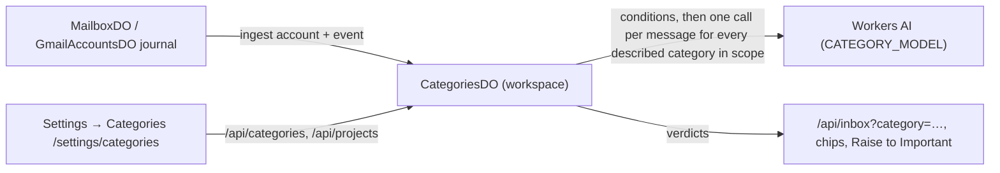
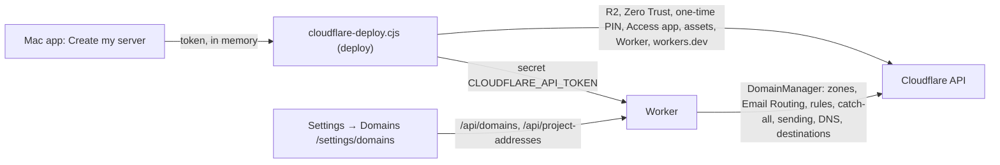
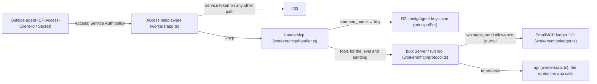

# Fabric Inbox — architecture as built

What runs today, on branch `main`. The target design and its open decisions are in
[desktop-mail/architecture.md](desktop-mail/architecture.md) (a proposal, not this).
Citations are `path (symbol)` so they survive line moves; `git grep <symbol>` resolves each.

## Shape

One Cloudflare Worker (`workers/app.ts`) serves the React Router app, the JSON API, the agent
protocol (MCP, [docs/agents/mcp.md](agents/mcp.md)) and the Email Routing entry point, behind Cloudflare Access. It runs in the user's own
Cloudflare account: the macOS Electron shell (`desktop/`) creates or updates it there from the
bundle it carries (`desktop/cloudflare-deploy.cjs (deploy)`), then loads it; it keeps no mail of
its own. With the account's API token as a secret, the Worker manages the account's domains
(`workers/routing/domains.ts (DomainManager)`).

```mermaid
flowchart LR
  ER["Cloudflare Email Routing"] -->|email()| RE["receiveEmail (workers/index.ts)"]
  RE -->|unknown address / foreign domain / >25 MB| BOUNCE["setReject → bounce"]
  RE -->|known mailbox| MB["MailboxDO (one per address)"]
  MB -->|incoming-event journal, alarm| AUTO["AutomationDO (rules, per account)"]
  MB -->|incoming-event journal, alarm| REG["AgentRegistryDO (workspace)"]
  REG -->|queue + alarm → runAgent| RUN["runner: prefilter → model + granted tools → policy"]
  RUN -->|draft| MB
  RUN -->|send, idempotent| OUT["MailboxDO outbox → EMAIL binding"]
  G["Gmail API"] <-->|OAuth, poll| GA["GmailAccountsDO (workspace): Gmail and IMAP accounts"]
  IM["IMAP over TLS / SMTP submission"] <-->|app password, poll| GA
  GA -->|incoming events| AUTO
  UI["Unified inbox /"] -->|/api/inbox + triage| MB
  UI --> GA
```

## Inbound mail on a project address

1. `workers/app.ts (email)` → `handleIncomingEmail` → `receiveEmail` (`workers/index.ts`).
2. Oversize mail is bounced. The SMTP envelope recipient is resolved by `resolveRecipient`:
   a served domain (`DOMAINS`) and an existing `mailboxes/<address>.json` in R2, else the
   domain's catch-all from `UNKNOWN_ADDRESS_POLICY`, else a permanent rejection. Unknown
   addresses are recorded without sender or body (`recordUnknownRecipient`).
3. The delivery id is a hash of mailbox, envelope sender and raw bytes, so a redelivery is
   stored once (`MailboxDO.receiveEmailOnce`). Inbox insertion and the incoming-event journal
   commit in one transaction.
4. The journal (`workers/actions/incoming.ts (IncomingJournal)`) is drained by the mailbox's
   alarm into every installed consumer — `AutomationDO.ingest` and
   `AgentRegistryDO.enqueue` — and acknowledged only when all accepted
   (`MailboxDO.drainIncomingEvents`). Both consumers are idempotent by message id.

## Agents on addresses (roadmap P2–P5)

| Piece | Where | What it guarantees |
|---|---|---|
| Definition | `workers/agents/definition.ts (AgentInputSchema)` | name, instructions, notes (`knowledge`), granted knowledge `collections`, tool grants, reply policy; strict schema; `search_knowledge`/`submit_answer` reserved |
| Registry | `workers/agents/registry.ts (AgentRegistryDO)` | immutable versions, optimistic `updateAgent(id, input, expectedVersion)`, soft delete (a deleted id is never recreated), runs, daily send budget (per UTC day), durable queue drained one message per mailbox at a time; a run cut off before `phase: "sending"` is claimed again, one cut off while sending is only reported |
| Assignment | `settings.agent` in the mailbox's R2 settings | `{ id }` or `"off"`; a mailbox without one migrates once to `mailbox-<address>` with its old prompt, drafting only |
| Prefilter | `workers/agents/prefilter.ts (prefilter)` | no-reply forms (with `_`/`.`, digits, a `noreply` substring), Auto-Submitted, Precedence, List-*, auto-replies, bounces, calendar mail (`text/calendar`, RSVP subjects), any sender on a served domain (`own_domain`: no loop between two agent addresses), already answered — checked against Reply-To when there is one, before any model call |
| Runner | `workers/agents/runner.ts (runAgent)` | resolves the assignment first (Off leaves no run), then claims one run per message; injection scan of the mail and of every tool result (a flagged result is withheld and the answer drafted); the thread shown to the model excludes drafts, trash, spam and later messages; replies to Reply-To in the sender's language, signed with the From name plus the mailbox signature, with `Auto-Submitted: auto-replied`; `phase: "sending"` is saved before the send; every exit after the claim writes the run with its reason |
| One answer per message (B-22) | `workers/agents/dedupe.ts (messageKey, electAnswerer, decideClaim)`, `AgentRegistryDO.claimMessage` | the copies of one message delivered to several agent addresses of the workspace answer it once. Key: the RFC Message-ID; without one a hash of sender, subject, `Date`, To and Cc; without a `Date` either, no key and each copy answers on its own. The answering address is the first agent address in To, else in Cc (header order), a Bcc copy last; a peer whose settings cannot be read counts as having an agent. The claim is one row of `agent_message_claims` in the workspace registry, decided in one SQLite transaction (copies running side by side cannot both win); a copy that is not chosen waits (no run recorded, polled every 30 s) until the chosen address starts, then records `skipped` "Duplicate: answered from <address>"; if the chosen address has not started within 20 minutes (the 15-minute spam hold plus margin) the waiting copy answers. Rows are pruned after 7 days. Addresses with no agent take no part; a copy delivered again to the same address keeps its own run (one per mailbox and message) |
| Policy | `workers/agents/policy.ts (decide)` | the only place an answer becomes a send: auto mode, grounded, allowed intent, daily budget, mailbox rate limit, no tool failure — otherwise a draft with the reason |
| Knowledge | `workers/knowledge/store.ts (KnowledgeDO)` | collections of source-addressed documents (source URI + revision), chunked at paragraphs and headings, SQLite FTS5 (porter + unicode61, bm25); `search` only within named collections; upsert idempotent, `prune` = full sync |
| Retrieval | `workers/agents/runner.ts (runAgent)` | before the model: top 5 passages from the agent's collections for subject + first 600 characters; `search_knowledge` for follow-ups (a repeated query is refused); passages' refs saved as `run.sources`; a failed search makes the answer a draft |
| Model | `workers/agents/model.ts (runModel, workersAiModel)` | Workers AI (`AGENT_MODEL`, default `@cf/moonshotai/kimi-k2.5`), 6 steps, 90 s; the last step offers `submit_answer` alone and a run that still ends without an answer gets one turn of its own 25 s that can only submit it (an abort keeps the text for a draft); no answer at all → `failed`, left for the operator |
| Tools | `workers/automation/mcp.ts (callMcpTool)` | remote MCP over Streamable HTTP; host checked against `AUTOMATION_MCP_HOSTS` at save and at call; bounded result kept in the run |
| Send | `MailboxDO.sendMail` | the one outgoing boundary: idempotency key = run id; accepted / failed / unknown; unknown is never retried |
| Routing | `workers/routing/email-routing.ts (EmailRoutingClient)` | reads a rule/catch-all to the Worker as verified, missing or unknown; creates a literal rule without duplicating |
| API | `workers/routes/agents.ts`, `workers/routes/knowledge.ts` | `/api/agents` (grants only existing collections), `/api/agent-runs` (`limit`, `before` = `createdAt|id` of the last run shown, `outcome` = answered / attention / skipped, `agent`, `mailbox`), `/api/project-addresses` (with `/check`, `/batch` and `/:email/test`), `/api/knowledge/*` (a collection in use cannot be deleted) |

The knowledge base the operator names as the single one is Fabric's project memory
([ADR-0069](https://github.com/passioncode-ai/fabric/blob/main/docs/adr/0069-project-memory-is-source-addressed-and-authority-bounded.md));
on 2026-09-29 it is a plan (MEM-P0…P7 undelivered). A collection's source is `manual` or
`fabric` (project + scope), and `POST /api/knowledge/collections/:id/documents` with `prune: true`
is the endpoint a Fabric memory sync is to call once MEM-P2 exposes search (board B-20).
| Screens | `app/components/settings/sections/AgentsSection.tsx` (`/settings/agents`), `app/components/settings/sections/AddressesSection.tsx` (`/settings/addresses`) | SCR-10, SCR-02 |

The interactive chat agent (`workers/agent/index.ts (EmailAgent)`, `/agents/*` WebSocket) is a
separate operator assistant; it no longer answers incoming mail.

## The unified feed and triage

`/api/inbox` (`workers/routes/inbox.ts (readInbox)`) merges Cloudflare mailboxes and Gmail
accounts with a keyset cursor per filter scope (`account`, `domain` = its Cloudflare addresses,
`provider`, `category`, `folder`, `q`, `unread`). Accounts are read by a pool of 8; unread is
counted for every inbox; a failed inbox keeps `hasMore` true so Load older stays. The same email
in several inboxes (one RFC Message-ID) is one row with `alsoIn`. Each message carries `triage`
from `shared/mail/triage.ts (triage)`: one of ten groups and important / normal / low, from header
signals (`signalsFromHeaders`; raw headers never leave the server), Gmail labels and the served
domains (`ownDomains`: mail from them is "Your addresses", never a person's unread mail). No model
is involved. The client (`app/components/inbox/TriagedList.tsx`, `triage-view.ts`) renders Focus
— Important first, the rest in groups the operator opens (kept for the session) — or Newest; the
selected message keeps its section until the selection changes, and Archive/Trash selects the next
one in the order shown.

## Mail providers (0.11)

Every account the server keeps for a provider — Gmail through Google sign-in, Outlook.com and
Microsoft 365 through Microsoft sign-in, any IMAP/SMTP mailbox through an app password — lives in
one `GmailAccountsDO` (`workspace`; the class and its
binding `GMAIL_ACCOUNTS` keep their first provider's name, since renaming a bound class is a
destructive storage step). The world names an account `<provider>:<id>` (`gmail:<id>`,
`imap:<id>`, `outlook:<id>`, `shared/mail/accounts.ts`); its record is `account:<id>` with a `provider` field, so
Gmail records of 0.10 are read as they are, with the same ids and cache.

| Part | Where | Contract |
|---|---|---|
| Shared by every provider | `workers/providers/account-service.ts (AccountService)` | records, sealed credentials, the message cache (`gmail-cache.ts`: one layout, providers map their state onto its labels), idempotent sends with `sending`/`accepted`/`unknown` receipts, the incoming-event queue for rules, agents and categories, status, backoff and reasons (`accountProblem`) |
| The provider's own work | `workers/providers/provider.ts (MailProvider, ProviderSession)` | a session per sync or action (`syncPage`, `message`, `change`, `attachment`, `headers`, `send`, drafts, `close`); `NotSentError` for a send refused before anything left (its reservation is removed, the same key may retry), any other failure after the hand-over is an unknown outcome |
| What an account can do | `ProviderCapabilities` (per account, in `GET /api/accounts`, the feed's accounts and `list_accounts`) | `organization` labels or folders, `threads` provider or headers, `drafts`, `archive`, `spam`, `trash`, `search` (cache), `sentCopy`, `auth`, `delivery` (poll); the app and the agent tools offer only what is true, and the routes refuse the rest (`not_supported`) |
| Gmail | `gmail-provider.ts` over `gmail-client.ts`, `gmail-sync.ts` | 0.10's behaviour, unchanged (below) |
| IMAP/SMTP | `workers/providers/imap/` | see "IMAP accounts" |
| Outlook (Microsoft Graph) | `workers/providers/outlook/` | see "Outlook accounts": `open()` gets the opened tokens and a `persist` that seals renewed (rotated) tokens into the record (and into every copy a sync writes later, `putAccount`); a refused grant is `reconnect_required`; a `retryAt` on a throttled answer is kept as the account's next try |

**Credentials** (`workers/providers/credentials.ts`). AES-256-GCM, bound to the account by the
additional data. The key is `MAIL_CREDENTIAL_KEY` (32 bytes, base64 or base64url), falling back
to `GMAIL_TOKEN_ENCRYPTION_KEY`, the only key before 0.11; a malformed `MAIL_CREDENTIAL_KEY` is no
key (never a silent fallback). Envelope version 2 (`{ version: 2, kid, iv, ciphertext }`) names
its key by fingerprint (first 9 bytes of SHA-256); version 1 envelopes and keys listed in
`MAIL_CREDENTIAL_KEY_PREVIOUS` keep opening and are sealed again with the current key the next
time the account is used, which is how the key is rotated. An envelope no key opens is
`reconnect_required` (`credentials_unreadable`). Create my server makes `MAIL_CREDENTIAL_KEY` once
(`desktop/cloudflare-deploy.cjs`); the Gmail and Outlook setups make it when the server has none.

**Schedule.** One alarm serves every account of every provider (`gmail-scheduler.ts`, below);
`MAIL_POLL_SECONDS` (else `GMAIL_POLL_SECONDS`, default 300) sets the interval; an account whose
provider is not set up on this server is left alone.

## Gmail sync, cache and refresh

Gmail's code is split from what every provider shares: `gmail-client.ts` (HTTP to Google),
`gmail-cache.ts` (storage layout, index, counters, migration — the cache every provider uses),
`gmail-sync.ts` (one page of history or of the import), `gmail-scheduler.ts` (when each account
syncs, Gmail and IMAP alike), `gmail-provider.ts` (Gmail as a `MailProvider`),
`account-service.ts` (accounts, credentials, actions, sends) and `accounts-do.ts` (the object and
its lock).

**Setup and reasons** (0.11). The server sets up its own Google client from Settings
(`workers/routes/gmail-setup.ts`: a check with Google's token endpoint and sign-in page in
`workers/gmail-setup/google-check.ts`, one settings change with its own Cloudflare token in
`workers/gmail-setup/server-settings.ts`). Connecting ends on a page per outcome
(`workers/gmail-setup/result-page.ts`). A failure about the account itself — the grant gone (7
days after connecting is a Testing app's expiry), the Gmail API off, the scope missing, the client
refused, the saved access unreadable — is kept on the account as `reason`, from a sync
(`syncPage`) and from a write (`withGmail`) alike (`accountProblem` in `account-service.ts`); the
words for each are in `shared/mail/gmail-reasons.ts`. Setup steps: [setup → Gmail](desktop-mail/setup.md#gmail).

**Sync model** (`gmail-sync.ts`). Connecting an account records Gmail's `historyId` before
anything is listed, and every sync reads history first, to its last page: new mail, label changes
and deletions reach the cache even while an import runs, and history no longer falls behind into
`history_expired`. The import then runs in phases: `recent` — the inbox of the last 30 days, newest
first, in full; `backfill` — every other message (spam and trash included) with headers only, its
body read from Gmail the first time it is opened; `sweep` — rows the import did not see under its
`generation` are deleted (they are gone from Gmail). `history_expired` starts a new import under a
new generation while the old cache stays visible until the sweep. A message whose own fetch keeps
failing is retried `MAX_MESSAGE_ATTEMPTS` (5) times, then set aside under `skipped:<acc>:<id>` and
counted in the account's `skipped`; offline, rate-limit and auth failures never count against a
message. Failed syncs back off 60 s doubling to 15 min; only `invalid_grant` from Google's token
endpoint asks for a reconnect (`reconnect_required`), a 401 that a fresh token does not cure is
`provider_auth_failed` and backs off.

**Schedule** (`gmail-scheduler.ts`). One alarm serves every account. A tick reads history for every
due account first, then gives imports the rest of a 25 s budget in fair shares, starting one account
further on each tick (`poll:offset`); while an import or a history page is unfinished the next tick
is 10 s away, otherwise `GMAIL_POLL_SECONDS` (default 300). An account waiting out a failure is
retried when its wait ends. A manual sync (`sync_account`), Refresh and a new connection never move
the alarm later; a new connection syncs at once. Each page runs under the object's lock on its own,
and cache reads take no lock, so the feed and mail actions never wait behind a sync.

**Cache layout 2** (`gmail-cache.ts`), per account `a`: `message:a:<id>` metadata rows;
`body:a:<id>:<blob>:<i>` body chunks under 128 KiB, deleted with their message (and any chunk a
failed save left); `idx:a:<folder>[~u]:<rev-ts>:<id>` one index row per folder the message is in,
plus `~u` while unread, newest first, holding what the feed shows; `count:a` the inbox's unread and
total, changed in the same transaction as every save and delete; `cache:a` the layout and a
migration's resume point. A page of the feed reads about one page of index rows however large the
cache; a search reads its folder's index until it has a page, up to 50,000 rows (`cache_scan_limit`
beyond). Caches written before 0.11 (layout 1: chunks under the message key, no index) move over in
resumable batches of 100 rows, each one transaction with its resume point, so nothing is indexed or
counted twice; rows layout 1 already hid are dropped. Reads migrate for up to 5 s and each alarm
tick a few seconds per account; until an account is done its reads use the old full scan.

**Refresh** (`POST /api/inbox/refresh`, tool `refresh_inbox`). Reads Gmail history for the Gmail
accounts in scope (every one, or the ones named; none for Cloudflare mail, which arrives by push)
within about 20 s shared fairly, without moving the alarm, and answers per account `synced` (with
`importing` percent while an import runs), `backoff` (with `retryAt`), `reconnect`, `failed` (with
`error`) or `not_reached`. Refresh — on the left of the toolbar, under the list's title, also ⌘⇧N
(Ctrl+Shift+N; ⌘R stays the Mac menu's Retry connection) — calls it, then reads the list and the
categories again.

**The status beside Refresh** (`app/lib/sync-status.ts (syncStatus)`, `app/components/inbox/SyncStatus.tsx`)
is the server's last successful read of each Gmail, IMAP and Outlook account in view (`lastSyncAt`;
the headline is the oldest of them), "Live" for Cloudflare addresses (they receive by push),
"Updating…" while Refresh or a read of the list runs, an import's percent, a wait the provider asked
for (`retryAt`, now in the feed's accounts), and an error that names the account and its fix (also
from the last Refresh's per-account outcomes). Its relative time ticks every 15 s only while the
page is visible (`app/hooks/useVisibleClock.ts`), in its own component, so the list never re-renders
for it.

**Freshness in the app** (`app/routes/unified-inbox.tsx`, `app/lib/mail-refresh.ts`). The list
polls every 60 s while the window is active (`pollInterval(useWindowActive())`); after Load older
only the first page is polled and joined to the loaded pages (`mergeHead`). Coming back to the
window, or the Mac waking (`powerMonitor` `resume` → `fabric:resumed` on the mail window's preload
bridge), reads the list at once, at most every 10 s. Categories are read with each read of the
list. A count the server could not read comes back `countsStale` and is drawn dimmed. Archive,
trash, spam, star and read show at once in every cached list and roll back if the server refuses.
**Keyboard** (`app/lib/mail-keys.ts`, `app/components/inbox/triage-actions.ts`): Delete or Backspace
archives and marks read; ⌘⌫ (Ctrl+Backspace) discards; both act on every message chosen together
(Shift+↓/↑, ⌘/Ctrl-click, Shift-click), move the rows out at once, open the next message and offer
Undo (⌘Z) for 10 s, which moves each back and makes it unread again if it was. ↓/J and ↑/K move; Esc
clears; ? shows the help. No key acts while the person types in a field or a dialog is open, and no
undefined combination does anything. The words of these parts live in tables per component
(`TRIAGE_TEXT`, `SYNC_TEXT`, `SHORTCUT_TEXT`, `DISCARD_SECTION_TEXT`) for localization.
Every API answer carries `X-Fabric-Build` (one id per build, `shared/build.ts`); a page with
another id offers "Reload to update", and a page that cannot load its own code after an update
reloads once (`app/lib/build-version.ts`).

## IMAP accounts (0.11, WS4)

An IMAP account is read with imapflow 2.2.5 over TLS from the first byte (port 993; IMAP STARTTLS
is never used) and written with this server's own SMTP submission client over `cloudflare:sockets`
(TLS on 465, STARTTLS on 587; never plain, never port 25), both measured in workerd: nodemailer
does not run there (2026-10-05 spike), and every preset's servers answered the built Worker on
2026-10-06 (IMAP and SMTP each refused a made-up account's sign-in over TLS).

| Part | Where | Contract |
|---|---|---|
| Presets | `shared/mail/imap-presets.ts` | iCloud Mail, Yahoo Mail, AOL Mail, Fastmail, Zoho Mail (personal and own domain), Yandex Mail, Mail.ru, GMX (gmx.com, gmx.net), Gmail with an app password, Other; each with the provider's page its servers were read from and its app-password page; `sentCopy` is "provider" only where the provider says it keeps sent mail (Gmail) |
| Connecting | `imap/connect.ts`, `ImapProvider.verify`, `AccountService.connectImap`, `POST /api/accounts/imap` | the IMAP login, the folder list and the Inbox, then the SMTP login, all before the password is sealed and the account stored; iCloud's IMAP takes the name before @ (Apple's page), the whole address is tried when that is refused; an address connected through Google sign-in is refused (`already_connected`); the same address again keeps its id and, on the same server, its cache |
| A new password | `AccountService.updateImapPassword`, `PUT /api/accounts/:id/password` | checked with both servers first; the old one stays until then |
| Errors | `imap/client.ts (loginFailure, connectionFailure)`, `imap/smtp.ts` | public codes only, server text never leaves: `auth_failed`, `app_password_required`, `imap_disabled`, `auth_or_imap_disabled` (Yandex says one sentence for both), `web_login_required`, `smtp_auth_failed`, `tls_failed`, `host_unreachable`, `smtp_unreachable`, `smtp_tls_failed`, `port_blocked`, `imap_tls_required`; during a sync a refused login is `reconnect_required`, an unreachable server `provider_unavailable` (backoff) |
| Identity | `imap/mime.ts (messageKey)` | a message is its folder's role key, the folder's UIDVALIDITY and its UID (`i-1712345678-42`); folders by role from SPECIAL-USE, else by the usual names in several languages (`imap/sync.ts mapFolders`); Gmail's All Mail is an archive target, not read |
| Labels | `imap/mime.ts (labelsFor)` | Inbox, Sent, Drafts, Trash, Junk → INBOX, SENT, DRAFT, TRASH, SPAM; Archive → none; no \Seen → UNREAD; \Flagged → STARRED; so the cache, the feed, triage, counts and search work unchanged |
| Threads | `imap/mime.ts (threadKey)` | the root Message-ID (first of References, else In-Reply-To, else its own), hashed to `t` + 16 hex |
| Sync | `imap/sync.ts (ImapSync)` | per folder: a changed UIDVALIDITY drops the folder's rows and starts it again; new mail (UIDs above `top`) is read whole (up to 2 MiB, else headers) and, in the Inbox, queued once for rules, agents and categories; flags from CONDSTORE (`CHANGEDSINCE` the last HIGHESTMODSEQ) where offered, else the newest 300 UIDs; deletions and moves by comparing the server's UID list with the cache when the folder's count differs (and every 6 hours); the import newest first by sequence number, 100 a step, headers only except the Inbox of the last 30 days; every step checks its deadline; a message that cannot be read is set aside under `skipped:` |
| Connections | `imap/provider.ts (ImapSession)` | one connection per sync (all its pages) and per action, logged out on `close()`; no IDLE in this release |
| Actions | `ImapSession.change` | read and star are flags; archive, trash, spam and back are moves (MOVE, else COPY + delete); the new UID comes from COPYUID or a Message-ID search; the old id answers for a week (`moved:<acc>:<old>`), so Undo from a list read before the move works; a target folder the server lacks is `not_supported` |
| Sending | `ImapSession.send` | Date and Message-ID added; Bcc only in the kept copy; after the server's 2xx the copy is appended to Sent (`\Seen`) unless the preset says the provider keeps it or Sent already has that Message-ID; a failed append never turns a sent message into a failure |
| Drafts | `ImapSession` drafts | the Drafts folder; a draft keeps its first message's id for life (`draft:<acc>:<draftId>` → current message), each save appends the new version and then deletes the old; its revision is the current message id; sending reads the draft, sends it through SMTP and deletes it |
| Attachments, headers | `imap/mime.ts` | read from the message's source when asked (attachment ids are their index) |

## Outlook accounts (0.11, WS5)

Outlook.com and Microsoft 365 mailboxes (`outlook:<id>`) are reached through Microsoft Graph v1.0
with the person's delegated consent; IMAP is not an option, since Outlook.com ended basic
authentication on 2024-09-16. Every endpoint, scope and limit below was read on learn.microsoft.com
on 2026-10-06 (the pages are cited in the module headers).

| Part | Where | Contract |
|---|---|---|
| Sign-in | `outlook/oauth.ts` | authorization code with PKCE (S256) on `login.microsoftonline.com/common/oauth2/v2.0` (work, school and personal accounts), the owner's app registration (`MICROSOFT_CLIENT_ID`, `MICROSOFT_CLIENT_SECRET`); scopes `offline_access Mail.ReadWrite Mail.Send User.Read`; the state under `oauth:` marked `provider: "outlook"` (a Gmail callback cannot use it), bound to the browser by `__Host-fabric-outlook-state`; a grant without a refresh token or without both mail permissions is refused (`insufficient_scope`) |
| Tokens | `outlook/graph.ts (GraphClient.token)`, `AccountService.session` | renewed a minute before they end; the refresh token Microsoft returns replaces the old one and is sealed into the record at once (`persist`); `invalid_grant` → `reconnect_required` (`microsoft_access_revoked`), `interaction_required`/`consent_required` → `reconnect_required` (`microsoft_signin_required`), `invalid_client` with AADSTS7000222 → `microsoft_secret_expired`, other `invalid_client`/`unauthorized_client` → `microsoft_client_rejected` (both `error`, fixed in the setup without a reconnect); 5xx and `temporarily_unavailable` → backoff |
| Requests | `outlook/graph.ts` | every request sends `Prefer: IdType="ImmutableId"` (a message keeps its id across folders); only Graph's own nextLink/deltaLink URLs are followed; 401 on a read refreshes once; 429 (and 503/504 with Retry-After) → `rate_limited` with `retryAt` from Retry-After (seconds or a date, within an hour), waited in place during a sync when it is at most 5 s and fits the deadline, else kept on the account; 410 or `syncStateNotFound` → `delta_reset`; `MailboxNotEnabledForRESTAPI` → `mailbox_unavailable` |
| Identity | `outlook/convert.ts` | Graph ids are longer than a storage key may be (128 characters): a message's id here is `o` + 24 characters of the SHA-256 of its immutable id (the Graph id kept as `remoteId` on the row, and under `gid:<acc>:<id>` for drafts and sends); a thread is `c` + 22 characters of the SHA-256 of `conversationId`; an attachment id is its Graph id in base64url |
| Labels | `outlook/convert.ts (labelsFor)` | Inbox, Sent Items, Drafts, Deleted Items, Junk Email → INBOX, SENT, DRAFT, TRASH, SPAM; Archive → none; `isRead: false` → UNREAD; `flag.flagStatus: flagged` → STARRED |
| Folders | `outlook/sync.ts (discover)` | the six by well-known name (`/me/mailFolders/{inbox,sentitems,drafts,deleteditems,junkemail,archive}`), listed at connect (which proves the mailbox exists) and daily; an account without an Archive folder has no archive capability |
| Sync | `outlook/sync.ts (OutlookSync)` | a delta query per folder (`/me/mailFolders/{id}/messages/delta`, `$select` of the cached properties, `Prefer: odata.maxpagesize=50`): the first round is the import, newest first (`$orderby=receivedDateTime desc`), Inbox, Sent, Archive, Drafts, Junk, Deleted Items, properties only (the body is read when opened); its nextLink is kept between ticks and its deltaLink starts history. History runs first every tick: each imported folder's delta round (new mail read whole — properties, MIME via `$value`, attachment list — and queued once for rules, agents and categories when it lands in the Inbox; changes relabelled; an `@removed` asked for once: gone → removed, in another synced folder → relabelled, elsewhere → removed), and for a folder still importing its newest 20 (mail received since connecting is news). A reset (410) imports the folder again under a new generation and then removes its rows the new round did not see |
| Actions | `OutlookSession.change` | read and flag are `PATCH` (`isRead`, `flag`); archive, trash, spam and back are `POST /me/messages/{id}/move` with the well-known name; the id stays |
| Sending | `OutlookSession.send` | the RFC 5322 text every provider makes (`rawMime`, with its own Message-ID; Bcc kept, Graph sends to it), created as a draft (`POST /me/messages`, `text/plain`, base64) and sent (`POST /me/messages/{id}/send`, 202; Graph keeps the copy in Sent Items, whose id is the draft's); MIME over 3 MB is created without its files, which are attached one by one: under 3 MB in one request, larger through an upload session in ranges under 4 MB to the pre-authenticated URL with no Authorization header; anything refused before `/send` (and `/send` refused with 4xx or 429) is `NotSentError` and the draft is deleted; `/send` with no answer is an unknown outcome |
| Drafts | `OutlookSession` drafts | the Drafts folder's messages; a draft's id is its message's for life, its revision a hash of `changeKey`; a save is `PATCH` of subject, body and recipients, then files deleted (not in `keepAttachments`) and added; sending a draft is `/send` on it; In-Reply-To and References are those it was created with |
| Attachments, headers | `OutlookSession` | a file by `/attachments/{id}/$value` (raw, up to 30 MB); headers from `internetMessageHeaders`, else the MIME source's (drafts and sent copies have none in Graph) |
| Setup | `workers/routes/microsoft-setup.ts`, `shared/mail/microsoft-setup.ts` | the values for the app registration, the secret's end date (`MICROSOFT_CLIENT_SECRET_EXPIRES`, warned 30 days ahead), the administrator's approval link (`organizations/v2.0/adminconsent`), the server's own settings written with `writeWorkerSettings`; the self-test renews one connected account's token (Microsoft checks a sign-in code's shape before the client, so nothing proves a client before its first sign-in) |
| Revoking | `OutlookProvider.revoke` | none: Microsoft has no request an app makes to give back one delegated grant; disconnecting deletes the tokens here and says where the person removes the app |

Throughput: Outlook allows one app 10,000 requests per 10 minutes and four concurrent requests per
mailbox, and 150 MB of uploads per 5 minutes; a session makes one request at a time, a tick reads
at most a few pages per folder, and Retry-After is honoured.

## Spam (SP-1…SP-6)

| Piece | Where | What it guarantees |
|---|---|---|
| Verdict on arrival | `shared/mail/spam.ts (authResults, spamCheck)`, `workers/index.ts (spamVerdict)` | only the topmost `Authentication-Results` written by `mx.cloudflare.net` decides a forgery first — a served domain failing its checks, or DMARC failing where the domain asks to reject or quarantine → Spam, whatever the lists say (0.8.2); then the operator's lists (allowed beats blocked and everything below); then SPF failing with no valid signature → Spam; a sender this mailbox has written to → clean; otherwise "screen". A failure to read the lists or the sent mail degrades to "screen" (the inbox, with the model's check still due) |
| Storage | `MailboxDO.receiveEmailOnce`, `emails.spam_reason` (migration `11_spam_reason`) | spam is stored in the `spam` folder with its reason; its journal event is marked, so no rule, agent or category acts on it; it is not forwarded as a copy |
| The model | `workers/categories/store.ts` (`SPAM_CATEGORY` in `classify`, `spam_checks`, `spam_budget`) | a screened message is judged once, in the same call as its categories when it has any, else within `SPAM_DAILY_LIMIT`; spam moves with the model's reason and leaves every category; almost empty mail (`tooLittleToJudge`) is not judged |
| Actions | `workers/routes/spam.ts`, `MailboxDO.markSpam/markNotSpam`, Gmail `setSpam` (SPAM label) | Report spam / Not spam put the sender (or domain) on the block or allow list in `config/spam.json`, written conditionally on its etag |
| Retention | `MailboxDO.purgeSpam` on the mailbox's alarm | spam older than 30 days goes with its attachments; `/api/spam/empty` deletes it all now; Gmail keeps its own spam |
| Screens | the Spam folder in the unified feed, `app/components/settings/sections/SpamSection.tsx` (SCR-14) | each row says why it is in Spam; Spam reads newest first with no triage marks |

A stranger's message waits in the agent queue for its spam check (`AgentRegistryDO.enqueue` with
`holdMs`, 15 minutes at most); `CategoriesDO` releases it once the check has answered, whatever the
answer, so spam never gets a draft and a model that never answers delays an answer without
dropping it. Agents skip a message that is in Spam or Trash by the time its run starts.

## Discarded (0.12, WS8)

Mail thrown away on purpose (⌘⌫, `discard_messages`), kept apart from Trash and Spam so a mistake can
come back, and learned from (operator decision 2026-10-06). Discarded counts as deleted: out of the
inbox, its counts and categories; kept 30 days.

| Piece | Where | What it guarantees |
|---|---|---|
| Rules and why | `shared/mail/discard.ts` (pure), R2 `config/discard.json` (`workers/discard/store.ts`, written conditionally on its etag) | each discard records the message's mailing list (List-Id) or newsletter mark (List-Unsubscribe), its sender, the sender's domain only for bulk senders and never a shared personal domain (gmail.com, icloud.com…), the category it was in, and a model's one-line guess when the server has Workers AI (`explainDiscard`, after the answer, 8 s, optional); a rule is keyed on the List-Id, else the sender's address, learned at the first discard and counted after; a sender the mailbox wrote to, one on the workspace's own domains, or one on Always allow is not learned (a list is); Undo (`unlearn`) takes a discard back; at most 2000 rules, the least recently used dropped |
| Cloudflare | `MailboxDO` (migrations `17_discarded`: folder `discarded`, `emails.discard_reason`, `emails.discarded_at`; `18_discarded_system_folder`); `discardMessages`, `restoreDiscarded`, `purgeDiscarded` on the alarm | read on discard; a second discard keeps its date; a folder the person had named Discarded keeps its mail under its own id — renamed "Discarded (your folder)", or, when the folder API had given it the id `discarded` (any name that slugs to it), moved to `discarded-yours` with its mail (mail without a `discarded_at`) and its own name; built-in folders (`shared/folders.ts isBuiltInFolder`) cannot be deleted, a new folder whose name slugs to one is refused (409), and a built-in folder found missing is made again before a delivery or a discard writes to it (`builtin_folder_recreated`), so delivery never fails for it |
| Gmail | `gmail-provider.ts` (`discardLabel`), `gmail-client.ts` (`labelAliases`) | the account's own label "Discarded" (found by name or made, its id kept under `label:<acc>:discarded`, made again once if deleted in Gmail); INBOX, UNREAD and SPAM removed; every message read through the client carries it as `DISCARDED` in the cache |
| IMAP | `imap/provider.ts` (`makeDiscarded`), `imap/client.ts` (`create`) | a folder named Discarded (or Выброшенные) is used, else created at the top level; it joins the synced folders (role `discarded`, ids `x-…`); `\Seen` set before the move; a server that refuses CREATE answers `folder_create_refused` — the person makes the folder and tries again |
| Outlook | `outlook/provider.ts` (`discardedFolder`), `outlook/sync.ts` (`findDiscarded`) | a top-level folder found by display name or made (`POST /me/mailFolders`), read (`isRead`), then moved; found at connect and daily like the well-known folders |
| The cache | `gmail-cache.ts` (`DISCARDED_LABEL`, `inFolder`) | `DISCARDED` is in no other view; `discarded` is a feed folder with its own index; counters exclude it; `discarded:<acc>:<id>` keeps why and since when |
| Arrival | `workers/index.ts (discardVerdict)` after `spamVerdict`; `accounts-do.ts (arrivalFilter)` in `AccountService.drainEvents` | mail matching a rule goes to Discarded before any rule, agent or category, with "Discarded automatically: you discarded N messages from …"; never mail from someone the account wrote to (Cloudflare: its Sent; remote: the cached Sent index, newest 5,000), a reply in a conversation it took part in, the workspace's own domains, or Always allow / Never spam senders; any failure delivers it as before — including a discard the provider refuses (a folder it will not make, an outage: `discard_arrival_failed`, the message stays in the inbox and goes to rules, agents and categories); a Cloudflare copy is not forwarded |
| Retention | `MailboxDO.purgeDiscarded`; `AccountService.purgeDiscarded` on the accounts alarm (25 a tick) | Cloudflare: deleted with attachments 30 days after `discarded_at`; Gmail, IMAP, Outlook: moved to the account's Trash, which the provider empties |
| Routes and tools | `workers/routes/discard.ts`; tools `discard_messages`, `restore_discarded`, `list_discard_rules`, `remove_discard_rule`, `update_discard_allow_list`, `list_messages` folder `discarded` | the shared routes are outside a mailbox-limited key's reach (they teach the whole workspace) |
| Screens | the Discarded folder in the unified feed; Settings → Discard rules (`app/components/settings/sections/DiscardSection.tsx`, SCR-16) | each row says why it is there; Not discarded names the rule to stop |

## Delivery guarantees

| Path | Guarantee | Where |
|---|---|---|
| Arrival | a delivery is stored once (id = hash of mailbox, sender, bytes) with its journal event in one transaction; a body too large for a row goes whole to R2 (`bodies/<id>.html`) | `workers/index.ts`, `MailboxDO.receiveEmailOnce/spillBody` |
| Forwarding copy | owed until attempted (`incoming_receipts.forward_status`); a retried delivery sends what it owes, once | `workers/index.ts (forwardCopy)` |
| Journal → rules, agents, categories | an event is acknowledged only when every consumer took it; a failing one waits its own backoff and is set aside after 10 attempts, counted and retried on request | `workers/actions/incoming.ts`, `MailboxDO.drainIncomingEvents/inboxCounts/retryIncoming` |
| Agents | one run per message; a message whose run was cut off waits in the queue until that run is stale; one message delivered to several agent addresses is answered once per workspace (B-22) | `workers/agents/registry.ts`, `workers/agents/dedupe.ts` |
| Gmail events | each event its own backoff, `dead:event:` after 10 | `workers/providers/account-service.ts (drainEvents)` |
| Outbox | an unknown outcome is never retried | `workers/actions/outbox*.ts` |
| Bounded stores | Spam 30 days after it entered Spam; Discarded 30 days after it was discarded (remote accounts: to their Trash); AutomationDO prunes daily | `MailboxDO.purgeSpam`, `MailboxDO.purgeDiscarded`, `AccountService.purgeDiscarded`, `AutomationDO.prune` |

## Addresses: one way to create and remove

`workers/lib/address-ops.ts` (`createAddress`, `removeAddress`, `setForwardCopy`,
`effectiveCatchAll`) is behind both Settings → Addresses (`/api/project-addresses`) and the legacy
mailbox route (`/api/v1/mailboxes`, used for the addresses a deployment's `EMAIL_ADDRESSES` lists). Every check runs before Cloudflare is touched; a rule the
call made is removed again when the mailbox cannot be saved; a zone the token cannot see gets its
address with a warning; the catch-all in effect (the deployment's `UNKNOWN_ADDRESS_POLICY` wins
over the stored choice) cannot be removed; what happens to the next message is read from
Cloudflare after the rule is gone. Since 0.12 (WS7) creating answers its `steps` (address, rule —
each done, already, skipped or failed with a `fix`); with `createRoute: "auto"` a rule that cannot be
made no longer costs the address (with `true` it still does). `checkAddresses`
(`GET /api/project-addresses/check`) reads Cloudflare once for a domain and several names
(`EmailRoutingClient.routingFor`) and says per name available, exists, elsewhere or invalid;
`createAddresses` (`POST /api/project-addresses/batch`) creates up to 50 one after another;
`sendRoutingTest` keeps the test's subject in R2 (`routing-tests/<address>.json`) and
`routingTestStatus` (`GET /api/project-addresses/:email/test`) finds it in the mailbox (any folder
but Sent and Drafts) or reports it not arrived after 3 minutes. The part before @ is checked by
`shared/address-name.ts`, the same module the dialog uses. `DomainManager.connect` leaves rules to another Worker alone
and keeps each address's agent and the chosen catch-all; `release` keeps serving when the zone
cannot be looked up and asks before giving up a zone the token cannot see.

## Categories (CAT-1…CAT-7)



| Piece | Where | What it guarantees |
|---|---|---|
| Definition | `workers/categories/definition.ts` | a project = domains + addresses; a category = scope (all, accounts, domains with subdomains, projects) + optional conditions (senders, subject words, text words: AND between groups, OR inside) + optional description + Raise to Important; `kindOf` is `scope` (no conditions, no description: the live feed of its inboxes) or `screened` |
| Classifier | `workers/categories/classify.ts (classify)` | one `generateObject` call per message for every described category in scope, a verdict with a reason for each; a category the model leaves out is an error, not a "no" |
| Store | `workers/categories/store.ts (CategoriesDO)` | projects, categories (a version per selection change), verdicts per (category, account, message), a queue drained by alarms (8 per pass, 4 at once, 5 attempts with backoff, then an error verdict), a daily model budget (`CATEGORY_DAILY_LIMIT`, default 500: the rest wait for the next UTC day), a backfill of the last 200 messages in scope on create or change |
| Feed | `workers/routes/inbox.ts (readCategory, markCategories)` | a scope category reads the feed of its inboxes; a screened one pages its verdicts, hydrates the messages and forgets the ones that are gone; every row gets its category chips, and a Raise to Important category raises unread and read rows with "Category: X" |
| API | `workers/routes/categories.ts` | `/api/categories` (with `accountIds` it covers, every inbox for the picker, limits), `/api/categories/:id`, `/:id/seen`, `/api/projects` (a project in use cannot be deleted) |
| Screens | `app/components/settings/sections/CategoriesSection.tsx` (`/settings/categories`), `app/components/inbox/CategorySidebar.tsx` | SCR-13; the sidebar section with counts (new since opened for screened, unread for scope) |

A message restored from Trash does not return to a described category until the category
changes (board B-26).

## Domains and the server's own account (CF-2, CF-5)



- `DomainManager.connect` is idempotent and ordered so no message is refused mid-change: routing on
  (another provider's MX only with `replaceMx`), domain served, mailboxes with their forwarded copy,
  then rules to the Worker, then sending and DMARC. `release` is its reverse and keeps the mail.
- Several accounts (0.8, [brief](app-store/tasks/2026-09-30-cloudflare-accounts.md)):
  `CloudflareAccounts` (`workers/routing/accounts.ts`) reads the server's token and every
  `CLOUDFLARE_API_TOKEN_<account id>` secret (the environment is the registry), lists their
  accounts, and resolves a domain to its zone, account, token and Worker; `DomainManager` works on
  each zone with its own account's token; only an active zone counts (a pending copy in another
  account is not where a domain's mail is), and a zone whose account cannot be told apart from the
  server's is refused rather than guessed. Which accounts show is the operator's choice in R2
  `config/cloudflare-accounts.json`, else the server's account and those with mail (or whose mail
  could not be read). An account whose saved token stopped working stays listed with the reason, so
  it can be replaced or removed. Tokens are connected and removed at `/api/cloudflare/accounts`
  (`workers/routes/cloudflare-accounts.ts`).
- The relay (`workers/relay/`): a zone's Email Routing reaches only Workers in the zone's own
  account, so a domain elsewhere routes to `fabric-inbox-relay`, which the server installs there
  (`install.ts`, registry R2 `config/relays.json`, sign-in = an Access service token through the
  agents' reusable policy, changed under the same lock as agent keys). Whether a relay is current is
  read from its own bindings (`RELAY_TOKEN_ID`, `RELAY_VERSION`, `SERVER_URL`); a reinstall
  registers the new sign-in before the upload and keeps the old one accepted as retiring for an hour;
  a failed or unconfirmed upload never deletes a working relay. The version is the source's
  fingerprint, and a relay reporting an older one is upgraded in the background. It POSTs the raw message to `/relay/incoming` (`ingress.ts`): only a
  registered relay, only for domains of its own account, through the same `receiveEmail`; a copy is
  forwarded by the relay and stays owed until `/relay/forwarded`. Mail from such a domain is sent
  through that account's Email Sending REST API (`workers/email-sender.ts (sendFromAccount)`); a
  4xx is a failure (`E_RATE_LIMIT_EXCEEDED` for 429, `E_RECIPIENT_SUPPRESSED` when every recipient
  was suppressed, else `E_REST_REFUSED`), anything else unknown; a refusal from the account it was
  remembered in looks the domain up once and sends from where it is now.
- `CloudflareApi` (`workers/routing/cloudflare-api.ts`) turns a refusal into the permission to add;
  `TOKEN_PERMISSIONS` there and `PERMISSIONS` in `desktop/cloudflare-deploy.cjs` are one list
  (`tests/desktop-deploy.test.ts`).
- The server bundle (`scripts/server-bundle.mjs`) is the build's ES modules, bindings, migrations
  and asset hashes computed as wrangler does; no deployment's values go in it.

## Drafts on the server (B-52, B-50)

A draft lives in its account: a Cloudflare mailbox's `draft` folder or Gmail's own drafts. The main
window's composer, the older per-mailbox screen and agents (`save_draft`, `send_draft`) all read and
change the same drafts; the copy in the main window's browser storage is a cache that keeps typing
safe offline and after a crash, never the source of truth.

| Part | Where | Contract |
|---|---|---|
| Cloudflare draft | `workers/lib/mailbox-drafts.ts`, `MailboxDO.saveDraft/listDrafts/deleteDraft`, routes in `workers/index.ts` | one id for a draft's life; saved in place in one transaction; `emails.draft_revision` (migration `16_draft_revision`, NULL reads as 1) rises by one each save; a save naming another revision is refused (`409 draft_conflict`), one for a draft gone (`draft_gone`), one for a non-draft id (`not_a_draft`); files are `attachments` rows with bytes in R2 under the draft, kept or removed by id, 10 files and 5 MB together; a long body goes to R2 under a key of its own for that save |
| IMAP draft | `workers/providers/imap/provider.ts (ImapSession)`, the same routes as Gmail's | the account's Drafts folder: one draft id for life, a new message (and revision) each save, the old one deleted after the new one is there; see "IMAP accounts" |
| Gmail draft | `workers/providers/account-service.ts (listDrafts, getDraft, updateDraft, deleteDraft, sendDraft)`, `workers/providers/gmail-provider.ts`, `workers/routes/accounts.ts` | Gmail's drafts API; a draft's revision is its message id (Gmail gives a new one on each change), checked before the change; kept files are read and written again with the new message; creation keeps its idempotent receipt |
| Send a draft | `MailboxDO.sendDraft` (`POST …/drafts/:id/send`); `AccountService.sendDraft` (`drafts.send`) | the draft goes out as it is — no signature or quote added — as a reply in its conversation when it answers a message, from the mailbox's display name; it leaves Drafts once accepted; the same idempotency key answers the first send after the draft is gone; a stale `expected_revision` is refused (`DRAFT_CONFLICT`) and nothing is sent |
| Main window | `app/components/inbox/server-drafts.ts`, `use-drafts.ts`, `Composer.tsx`, `DraftsDialog.tsx` | each change is kept on the device at once and saved to the server 1.5 s later under the revision it read; a conflict is shown with "Show the saved version" / "Keep my version"; Send saves first and sends the server's draft; Drafts lists every account's server drafts (agents' too) beside the ones still only here; drafts kept only on the device before 0.11 are saved up on first run and stay until the server confirms; a Gmail draft waits for a valid recipient |

## The agent protocol (AP-1…AP-11)

`/mcp` gives an outside agent the whole app, limited by its key. Reference and rules:
[docs/agents/mcp.md](agents/mcp.md); decisions: [brief](app-store/tasks/2026-09-29-agent-protocol.md).



| Part | Where | Contract |
|---|---|---|
| Keys | `workers/routes/agent-keys.ts`, `workers/mcp/access.ts (AgentAccess)` | a Cloudflare service token per key, let through by one reusable `non_identity` policy per server attached to its Access app (the app's other policies and settings kept); a token the registry could not save is deleted again; revoke removes the key from the registry first (it stops at once), then the token |
| Identity | `workers/mcp/keys.ts (principalFor, identityMayUse)` | an email = the owner (`admin`, sends without a limit); a `common_name` = a registered, unexpired key; a service token is refused on every path but `/mcp` |
| Mailbox scope | `workers/mcp/scope.ts (toolFitsScope, scopedApi)` | a Read or Mail key may name its accounts (AP-11): its tool list keeps only tools whose every route stays in one mailbox or reads the feed, and every in-process route call is checked against its accounts (other mailbox or shared setting → 403); the feed is narrowed on the way in and filtered on the way out (rows, accounts, issues, cursors), a category filter is refused, several mailboxes are merged into one page; a damaged list reaches nothing |
| Narrowing header | `workers/mcp/scope.ts (narrowPrincipal)`, `workers/mcp/handler.ts` | `X-Fabric-Accounts` intersects the caller's accounts with the named ones (never widens); an empty result is refused before any tool |
| Connect link (desktop) | `desktop/connect.cjs`, `desktop/main.cjs` | `fabric-inbox://connect` from a hub on this Mac → native Allow/Deny → key made through the owner's session (`POST /api/agent-keys`) → posted once to a loopback callback, revoked if not received; the scheme is registered by the packagers |
| Tools | `workers/mcp/tools.ts (TOOLS, NOT_TOOLS)` | each tool calls the app's own routes in-process and names them; `tests/mcp-coverage.test.ts` holds every served route to a tool or an exclusion with its reason |
| Rules around a call | `workers/mcp/protocol.ts (runTool)` | not listed = not callable; irreversible tools answer with a summary and a one-time code first (5 minutes, bound to key, tool and arguments); sending tools take one of the key's daily sends, refunded when the route refused; every change journalled |
| Ledger | `workers/mcp/ledger.ts (EmailMCP)` | confirmations, send counts per key and UTC day, the journal (last 5000); upstream's class name kept because removing a bound class is a destructive storage step |
| Docs | `scripts/mcp-docs.ts` | the tool reference in docs/agents/mcp.md is generated; `tests/mcp-docs.test.ts` fails when it is stale |
| Skill | `plugins/fabric-inbox/skills/working-with-fabric-inbox/` | shipped as a member of `@passioncode-ai/passioncode`; `tests/mcp-skill.test.ts` fails when it names a tool that does not exist |

## Stores

| Data | Holder |
|---|---|
| Mailbox settings, agent assignment | R2 `mailboxes/<address>.json` |
| Mail, drafts (with their revision), folders, attachments metadata, outbox, incoming journal | `MailboxDO` SQLite, one per address |
| Main-window drafts, cached on the device until saved to the server | browser `localStorage` (`fabric-inbox:workbench-drafts:v2:*`) and IndexedDB for files not yet uploaded |
| Attachment bytes | R2 `attachments/<emailId>/<attachmentId>/<filename>` |
| Unknown recipients | R2 `unknown-recipients/<domain>/<address>.json` |
| Domains served at runtime, catch-all mailboxes | R2 `config/domains.json`, `config/catch-all.json` |
| Which Cloudflare accounts show; which account each domain was last seen in | R2 `config/cloudflare-accounts.json`, `config/domain-accounts.json` (a cache) |
| Relays in other accounts (no secrets: account, service token id and Client ID, server address, version) | R2 `config/relays.json` |
| Tokens for other Cloudflare accounts | Worker secrets `CLOUDFLARE_API_TOKEN_<account id>` |
| Last failed forwarded copy per address | R2 `delivery-issues/<address>.json` (cleared by the next success) |
| Agents, versions, runs (last 2000), send counters, agent queue, message claims (7 days) | `AgentRegistryDO` SQLite (`workspace`) |
| Knowledge collections, documents, chunks, FTS5 index | `KnowledgeDO` SQLite (`workspace`), migration `fabric-v3` |
| Projects, categories, verdicts, category queue, model budget, backfills, spam checks and their budget | `CategoriesDO` SQLite (`workspace`), migration `fabric-v4` |
| Spam lists (blocked and allowed senders and domains) | R2 `config/spam.json` |
| Discard rules (list or sender, why, counts) and the Always allow list | R2 `config/discard.json` |
| Why a message is in Discarded, and since when | `MailboxDO` `emails.discard_reason`, `emails.discarded_at`; `GmailAccountsDO` `discarded:<acc>:<id>` |
| A Gmail account's Discarded label id | `GmailAccountsDO` `label:<acc>:discarded` |
| Why a message is in Spam, and since when | `MailboxDO` `emails.spam_reason`, `emails.spam_at` |
| A body too large for a row | R2 `bodies/<id>.html` (`emails.body_key`) |
| Addresses hidden from the sidebar and All inboxes | R2 `config/hidden-accounts.json` |
| Rules, rule runs | `AutomationDO` storage, one per account |
| Gmail and Outlook tokens and IMAP app passwords (AES-GCM envelopes, version 2 names its key; see "Mail providers"), IMAP server names and folder state, Outlook folder ids and delta links, message cache of all three (layout 2: rows, bodies, date index, inbox counters; see "Gmail sync, cache and refresh"), set-aside messages, send and draft receipts, moved-message aliases, IMAP draft ids, Outlook Graph ids of drafts and sends (`gid:`) | `GmailAccountsDO` (`workspace`) |
| The Outlook app registration's client secret, and its end date | Worker secret `MICROSOFT_CLIENT_SECRET`, var `MICROSOFT_CLIENT_SECRET_EXPIRES` |
| Outlook drafts | the Outlook account's Drafts folder, read live |
| The key credentials are sealed with | Worker secret `MAIL_CREDENTIAL_KEY` (or `GMAIL_TOKEN_ENCRYPTION_KEY`), older keys in `MAIL_CREDENTIAL_KEY_PREVIOUS` |
| IMAP drafts | the IMAP account's Drafts folder, read live |
| Gmail drafts | the Gmail account itself (drafts API), read live, not cached |
| Chat history | `EmailAgent` per mailbox |
| Agent keys (no secrets: id, Client ID, name, level, sending, limit, dates) | R2 `config/agent-keys.json` |
| Agent protocol confirmations, send counts, journal | `EmailMCP` SQLite (`workspace`) |

**Schema versions.** `MailboxDO` runs `workers/durableObject/migrations.ts` (`d1_migrations`).
`AgentRegistryDO`, `KnowledgeDO`, `CategoriesDO` and `EmailMCP` run their own step lists
(`workers/{agents,knowledge,categories}/schema.ts`) through `migrateSchema`
(`workers/lib/do-schema.ts`): each object records the steps it ran in `schema_steps`; a step runs
once, in one transaction with its record, so a failed step leaves nothing and is retried on the next
start; step 1 is the schema as released before versioning (`IF NOT EXISTS`), so older objects record
it unchanged. Steps are only appended, numbered from 1 without gaps (checked at start and in
`tests/do-schema.test.ts`); a step recorded by a newer release is logged as `schema.newer_than_code`
and left alone. `AutomationDO` and `GmailAccountsDO` keep key-value storage, not SQL: a new field is
read with a default where it is missing, never assumed present.

## Modules

| Path | Role |
|---|---|
| `workers/app.ts` | Access check, security headers, same-origin mutation boundary, routing |
| `workers/index.ts` | mailbox HTTP API, inbound mail |
| `workers/durableObject/` | `MailboxDO` and its migrations |
| `workers/actions/` | outbox and incoming journal stores |
| `workers/agents/` | address agents: definition, registry, prefilter, runner, one answer per message (dedupe), policy, model |
| `workers/categories/` | categories: definition and matching, the classifier, `CategoriesDO` (also the spam model) |
| `workers/spam/`, `shared/mail/spam.ts` | spam lists in R2; the verdict on arrival |
| `workers/discard/`, `shared/mail/discard.ts`, `workers/routes/discard.ts` | Discarded: rules in R2, why, matching and safety on arrival, the routes |
| `workers/knowledge/` | knowledge store (`KnowledgeDO`) and pure text work (chunking, FTS query quoting) |
| `workers/automation/` | rules engine, policy, MCP client |
| `workers/providers/` | the provider interface, credentials, account service, `GmailAccountsDO`, scheduler, cache; Gmail OAuth, client, sync loop and provider |
| `workers/providers/imap/` | IMAP/SMTP: the imapflow connection, the SMTP client and its sockets, MIME and labels, the sync, the provider and session, connect input |
| `workers/providers/outlook/` | Outlook through Microsoft Graph: sign-in and tokens, the Graph client (immutable ids, throttling), ids and labels, the delta sync, the provider and session |
| `workers/microsoft-setup/` | the Outlook connect result page |
| `workers/gmail-setup/` | the Gmail setup: the self-test against Google, the server's own settings write, the connect result page |
| `workers/routing/` | Cloudflare API client, the accounts the tokens reach (`accounts.ts`), Email Routing status, `DomainManager` (domains, rules, catch-all, sending, destinations), setup from routing |
| `workers/relay/` | the relay Worker's source, installing it in another account, and where it hands mail over |
| `workers/routes/` | accounts, Gmail setup, Outlook setup, unified inbox, agents and project addresses, categories and projects, domains, setups |
| `workers/lib/` | mailbox store (settings, served domains, catch-alls, delete), applying a setup, security headers |
| `workers/mcp/` | the agent protocol: identity and keys, Access service tokens, tools, the ledger, instructions |
| `workers/api.ts` | every JSON route as one app, mounted by `workers/app.ts` and called in-process by the agent protocol |
| `shared/mail/` | contracts shared by Worker and client (inbox, triage, send, attachments) |
| `app/routes/unified-inbox.tsx` | the main workbench |
| `app/components/inbox/` | list, composer, drafts, message actions, sidebar grouped by domain |
| `app/components/settings/sections/KnowledgeSection.tsx` | Knowledge: collections, documents, upload, try a search |
| `app/routes/settings.tsx` | Settings (SCR-02): the section list and the section shown, at `/settings/:section/:id?/:tab?` |
| `app/routes/settings-redirect.tsx` | the older page addresses (`/projects`, `/accounts`, `/mailboxes`, `/ai-agents`, `/knowledge`, `/categories`, `/spam`, `/agent-access`, `/setup`, `/mailbox/:id/settings`), each a redirect into its section (`legacyTarget` in `app/components/settings/paths.ts`) |
| `app/components/settings/` | the parts every section shares (`ui.tsx`: list, panel, ⋯ menu, one confirmation dialog, per-row work and results, unsaved-change guard; `list-model.ts`: stable groups, search, arrow keys; `paths.ts`) and one file per section under `sections/` |
| `app/components/domains/StepList.tsx` | the step list a domain action leaves |
| `desktop/` | Electron host, first run, creating the server (`cloudflare-deploy.cjs`), profile hygiene (`profile.cjs`), packaging (`dist-mac.mjs`, `package.mjs`, `mas-package.mjs`) with hardened fuses and purpose strings (`hardening.mjs`) and release retention (`release-retention.mjs`) |
| `scripts/server-bundle.mjs` | the server the app carries |
| `deployments/<name>/` | one deployment's own values, setup and ops receipts; local only (git-ignored), never shipped; the guide and `*.example.json` shapes are `deployments/README.md` |
| `scripts/deployment-setup.ts` | builds `deployments/<name>/setup.json` from a read-only Email Routing inventory with the server's own conversion |

`scripts/settings-scroll-check.mjs` drives a running app over the DevTools protocol and checks that choosing a row in a long Settings list moves neither the page nor the list, at 1360 px and 800 px.

## Boundaries worth knowing

- Access admits a person to the whole workspace; there is no per-mailbox authorization. An agent
  key is limited by level and sending mode, not by mailbox.
- Tool output reaches the model and the run record (bounded), never the rule journal.
- `checkSendRateLimit` reads the same budget the outbox enforces (20/hour, 100/day per address).
- An IMAP account is read on the poll interval (default 5 minutes) or Refresh: no IDLE, so new
  mail is not instant. Searches read the mail synced here, not the provider's own search. Gmail
  through IMAP shows labels as folders and does not read All Mail, so an archived message leaves
  the app's lists (connect Gmail through Google for labels).
- An Outlook account is read on the poll interval too (no Graph change notifications: they need
  a public webhook and renewing subscriptions); its older mail is imported without bodies, 50
  messages a page; folders besides the six well-known ones are not read.
- A Gmail import of a large mailbox still takes a while (about 100 headers-only messages per
  page, six requests in flight, ticks 10 s apart while it runs); new mail is unaffected because
  history runs from the start. A search over more than 50,000 cached rows of one folder answers
  `cache_scan_limit`.
