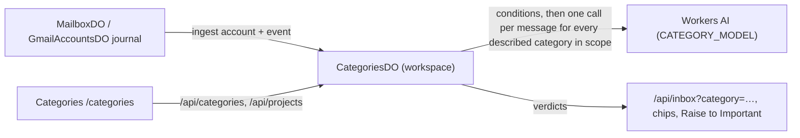
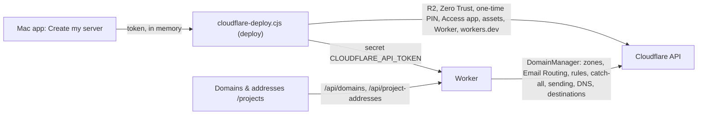
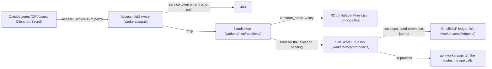

# Fabric Inbox — architecture as built

What runs today, on branch `main`. The target design and its open decisions are in
[desktop-mail/architecture.md](desktop-mail/architecture.md) (a proposal, not this).
Citations are `path (symbol)` so they survive line moves; `git grep <symbol>` resolves each.

## Shape

One Cloudflare Worker (`workers/app.ts`) serves the React Router app, the JSON API, the agent
protocol (MCP, [docs/agents/mcp.md](agents/mcp.md)) and the Email Routing entry point, behind Cloudflare Access. It runs in the user's own
Cloudflare account: the macOS Electron shell (`desktop/`) creates or updates it there from the
bundle it carries (`desktop/cloudflare-deploy.cjs (deploy)`), then loads it; it keeps no mail of
its own. With the account's API token as a secret, the Worker manages the account's domains
(`workers/routing/domains.ts (DomainManager)`).

```mermaid
flowchart LR
  ER["Cloudflare Email Routing"] -->|email()| RE["receiveEmail (workers/index.ts)"]
  RE -->|unknown address / foreign domain / >25 MB| BOUNCE["setReject → bounce"]
  RE -->|known mailbox| MB["MailboxDO (one per address)"]
  MB -->|incoming-event journal, alarm| AUTO["AutomationDO (rules, per account)"]
  MB -->|incoming-event journal, alarm| REG["AgentRegistryDO (workspace)"]
  REG -->|queue + alarm → runAgent| RUN["runner: prefilter → model + granted tools → policy"]
  RUN -->|draft| MB
  RUN -->|send, idempotent| OUT["MailboxDO outbox → EMAIL binding"]
  G["Gmail API"] <-->|OAuth, poll| GA["GmailAccountsDO (workspace)"]
  GA -->|incoming events| AUTO
  UI["Unified inbox /"] -->|/api/inbox + triage| MB
  UI --> GA
```

## Inbound mail on a project address

1. `workers/app.ts (email)` → `handleIncomingEmail` → `receiveEmail` (`workers/index.ts`).
2. Oversize mail is bounced. The SMTP envelope recipient is resolved by `resolveRecipient`:
   a served domain (`DOMAINS`) and an existing `mailboxes/<address>.json` in R2, else the
   domain's catch-all from `UNKNOWN_ADDRESS_POLICY`, else a permanent rejection. Unknown
   addresses are recorded without sender or body (`recordUnknownRecipient`).
3. The delivery id is a hash of mailbox, envelope sender and raw bytes, so a redelivery is
   stored once (`MailboxDO.receiveEmailOnce`). Inbox insertion and the incoming-event journal
   commit in one transaction.
4. The journal (`workers/actions/incoming.ts (IncomingJournal)`) is drained by the mailbox's
   alarm into every installed consumer — `AutomationDO.ingest` and
   `AgentRegistryDO.enqueue` — and acknowledged only when all accepted
   (`MailboxDO.drainIncomingEvents`). Both consumers are idempotent by message id.

## Agents on addresses (roadmap P2–P5)

| Piece | Where | What it guarantees |
|---|---|---|
| Definition | `workers/agents/definition.ts (AgentInputSchema)` | name, instructions, notes (`knowledge`), granted knowledge `collections`, tool grants, reply policy; strict schema; `search_knowledge`/`submit_answer` reserved |
| Registry | `workers/agents/registry.ts (AgentRegistryDO)` | immutable versions, optimistic `updateAgent(id, input, expectedVersion)`, soft delete (a deleted id is never recreated), runs, daily send budget (per UTC day), durable queue drained one message per mailbox at a time; a run cut off before `phase: "sending"` is claimed again, one cut off while sending is only reported |
| Assignment | `settings.agent` in the mailbox's R2 settings | `{ id }` or `"off"`; a mailbox without one migrates once to `mailbox-<address>` with its old prompt, drafting only |
| Prefilter | `workers/agents/prefilter.ts (prefilter)` | no-reply forms (with `_`/`.`, digits, a `noreply` substring), Auto-Submitted, Precedence, List-*, auto-replies, bounces, calendar mail (`text/calendar`, RSVP subjects), any sender on a served domain (`own_domain`: no loop between two agent addresses), already answered — checked against Reply-To when there is one, before any model call |
| Runner | `workers/agents/runner.ts (runAgent)` | resolves the assignment first (Off leaves no run), then claims one run per message; injection scan of the mail and of every tool result (a flagged result is withheld and the answer drafted); the thread shown to the model excludes drafts, trash, spam and later messages; replies to Reply-To in the sender's language, signed with the From name plus the mailbox signature, with `Auto-Submitted: auto-replied`; `phase: "sending"` is saved before the send; every exit after the claim writes the run with its reason |
| One answer per message (B-22) | `workers/agents/dedupe.ts (messageKey, electAnswerer, decideClaim)`, `AgentRegistryDO.claimMessage` | the copies of one message delivered to several agent addresses of the workspace answer it once. Key: the RFC Message-ID; without one a hash of sender, subject, `Date`, To and Cc; without a `Date` either, no key and each copy answers on its own. The answering address is the first agent address in To, else in Cc (header order), a Bcc copy last; a peer whose settings cannot be read counts as having an agent. The claim is one row of `agent_message_claims` in the workspace registry, decided in one SQLite transaction (copies running side by side cannot both win); a copy that is not chosen waits (no run recorded, polled every 30 s) until the chosen address starts, then records `skipped` "Duplicate: answered from <address>"; if the chosen address has not started within 20 minutes (the 15-minute spam hold plus margin) the waiting copy answers. Rows are pruned after 7 days. Addresses with no agent take no part; a copy delivered again to the same address keeps its own run (one per mailbox and message) |
| Policy | `workers/agents/policy.ts (decide)` | the only place an answer becomes a send: auto mode, grounded, allowed intent, daily budget, mailbox rate limit, no tool failure — otherwise a draft with the reason |
| Knowledge | `workers/knowledge/store.ts (KnowledgeDO)` | collections of source-addressed documents (source URI + revision), chunked at paragraphs and headings, SQLite FTS5 (porter + unicode61, bm25); `search` only within named collections; upsert idempotent, `prune` = full sync |
| Retrieval | `workers/agents/runner.ts (runAgent)` | before the model: top 5 passages from the agent's collections for subject + first 600 characters; `search_knowledge` for follow-ups (a repeated query is refused); passages' refs saved as `run.sources`; a failed search makes the answer a draft |
| Model | `workers/agents/model.ts (runModel, workersAiModel)` | Workers AI (`AGENT_MODEL`, default `@cf/moonshotai/kimi-k2.5`), 6 steps, 90 s; the last step offers `submit_answer` alone and a run that still ends without an answer gets one turn of its own 25 s that can only submit it (an abort keeps the text for a draft); no answer at all → `failed`, left for the operator |
| Tools | `workers/automation/mcp.ts (callMcpTool)` | remote MCP over Streamable HTTP; host checked against `AUTOMATION_MCP_HOSTS` at save and at call; bounded result kept in the run |
| Send | `MailboxDO.sendMail` | the one outgoing boundary: idempotency key = run id; accepted / failed / unknown; unknown is never retried |
| Routing | `workers/routing/email-routing.ts (EmailRoutingClient)` | reads a rule/catch-all to the Worker as verified, missing or unknown; creates a literal rule without duplicating |
| API | `workers/routes/agents.ts`, `workers/routes/knowledge.ts` | `/api/agents` (grants only existing collections), `/api/agent-runs` (`limit`, `before` = `createdAt|id` of the last run shown, `outcome` = answered / attention / skipped, `agent`, `mailbox`), `/api/project-addresses`, `/api/knowledge/*` (a collection in use cannot be deleted) |

The knowledge base the operator names as the single one is Fabric's project memory
([ADR-0069](https://github.com/passioncode-ai/fabric/blob/main/docs/adr/0069-project-memory-is-source-addressed-and-authority-bounded.md));
on 2026-09-29 it is a plan (MEM-P0…P7 undelivered). A collection's source is `manual` or
`fabric` (project + scope), and `POST /api/knowledge/collections/:id/documents` with `prune: true`
is the endpoint a Fabric memory sync is to call once MEM-P2 exposes search (board B-20).
| Screens | `app/routes/agents.tsx` (`/ai-agents`), `app/routes/project-addresses.tsx` (`/projects`) | SCR-10, SCR-09 |

The interactive chat agent (`workers/agent/index.ts (EmailAgent)`, `/agents/*` WebSocket) is a
separate operator assistant; it no longer answers incoming mail.

## The unified feed and triage

`/api/inbox` (`workers/routes/inbox.ts (readInbox)`) merges Cloudflare mailboxes and Gmail
accounts with a keyset cursor per filter scope (`account`, `domain` = its Cloudflare addresses,
`provider`, `category`, `folder`, `q`, `unread`). Accounts are read by a pool of 8; unread is
counted for every inbox; a failed inbox keeps `hasMore` true so Load older stays. The same email
in several inboxes (one RFC Message-ID) is one row with `alsoIn`. Each message carries `triage`
from `shared/mail/triage.ts (triage)`: one of ten groups and important / normal / low, from header
signals (`signalsFromHeaders`; raw headers never leave the server), Gmail labels and the served
domains (`ownDomains`: mail from them is "Your addresses", never a person's unread mail). No model
is involved. The client (`app/components/inbox/TriagedList.tsx`, `triage-view.ts`) renders Focus
— Important first, the rest in groups the operator opens (kept for the session) — or Newest; the
selected message keeps its section until the selection changes, and Archive/Trash selects the next
one in the order shown.

## Gmail sync, cache and refresh

All Gmail accounts live in one `GmailAccountsDO` (`workspace`). Its code is split so another
provider can take Gmail's place: `gmail-client.ts` (HTTP to Google), `gmail-cache.ts` (storage
layout, index, counters, migration), `gmail-sync.ts` (one page of history or of the import),
`gmail-scheduler.ts` (when each account syncs), `account-service.ts` (accounts, credentials,
actions, sends) and `accounts-do.ts` (the object and its lock).

**Sync model** (`gmail-sync.ts`). Connecting an account records Gmail's `historyId` before
anything is listed, and every sync reads history first, to its last page: new mail, label changes
and deletions reach the cache even while an import runs, and history no longer falls behind into
`history_expired`. The import then runs in phases: `recent` — the inbox of the last 30 days, newest
first, in full; `backfill` — every other message (spam and trash included) with headers only, its
body read from Gmail the first time it is opened; `sweep` — rows the import did not see under its
`generation` are deleted (they are gone from Gmail). `history_expired` starts a new import under a
new generation while the old cache stays visible until the sweep. A message whose own fetch keeps
failing is retried `MAX_MESSAGE_ATTEMPTS` (5) times, then set aside under `skipped:<acc>:<id>` and
counted in the account's `skipped`; offline, rate-limit and auth failures never count against a
message. Failed syncs back off 60 s doubling to 15 min; only `invalid_grant` from Google's token
endpoint asks for a reconnect (`reconnect_required`), a 401 that a fresh token does not cure is
`provider_auth_failed` and backs off.

**Schedule** (`gmail-scheduler.ts`). One alarm serves every account. A tick reads history for every
due account first, then gives imports the rest of a 25 s budget in fair shares, starting one account
further on each tick (`poll:offset`); while an import or a history page is unfinished the next tick
is 10 s away, otherwise `GMAIL_POLL_SECONDS` (default 300). An account waiting out a failure is
retried when its wait ends. A manual sync (`sync_account`), Refresh and a new connection never move
the alarm later; a new connection syncs at once. Each page runs under the object's lock on its own,
and cache reads take no lock, so the feed and mail actions never wait behind a sync.

**Cache layout 2** (`gmail-cache.ts`), per account `a`: `message:a:<id>` metadata rows;
`body:a:<id>:<blob>:<i>` body chunks under 128 KiB, deleted with their message (and any chunk a
failed save left); `idx:a:<folder>[~u]:<rev-ts>:<id>` one index row per folder the message is in,
plus `~u` while unread, newest first, holding what the feed shows; `count:a` the inbox's unread and
total, changed in the same transaction as every save and delete; `cache:a` the layout and a
migration's resume point. A page of the feed reads about one page of index rows however large the
cache; a search reads its folder's index until it has a page, up to 50,000 rows (`cache_scan_limit`
beyond). Caches written before 0.11 (layout 1: chunks under the message key, no index) move over in
resumable batches of 100 rows, each one transaction with its resume point, so nothing is indexed or
counted twice; rows layout 1 already hid are dropped. Reads migrate for up to 5 s and each alarm
tick a few seconds per account; until an account is done its reads use the old full scan.

**Refresh** (`POST /api/inbox/refresh`, tool `refresh_inbox`). Reads Gmail history for the Gmail
accounts in scope (every one, or the ones named; none for Cloudflare mail, which arrives by push)
within about 20 s shared fairly, without moving the alarm, and answers per account `synced` (with
`importing` percent while an import runs), `backoff` (with `retryAt`), `reconnect`, `failed` (with
`error`) or `not_reached`. The inbox's "Check for new mail" button calls it, then reads the list and
the categories again and shows "Updated just now" or which accounts were not read.

**Freshness in the app** (`app/routes/unified-inbox.tsx`, `app/lib/mail-refresh.ts`). The list
polls every 60 s while the window is active (`pollInterval(useWindowActive())`); after Load older
only the first page is polled and joined to the loaded pages (`mergeHead`). Coming back to the
window, or the Mac waking (`powerMonitor` `resume` → `fabric:resumed` on the mail window's preload
bridge), reads the list at once, at most every 10 s. Categories are read with each read of the
list. A count the server could not read comes back `countsStale` and is drawn dimmed. Archive,
trash, spam, star and read show at once in every cached list and roll back if the server refuses.
Every API answer carries `X-Fabric-Build` (one id per build, `shared/build.ts`); a page with
another id offers "Reload to update", and a page that cannot load its own code after an update
reloads once (`app/lib/build-version.ts`).

## Spam (SP-1…SP-6)

| Piece | Where | What it guarantees |
|---|---|---|
| Verdict on arrival | `shared/mail/spam.ts (authResults, spamCheck)`, `workers/index.ts (spamVerdict)` | only the topmost `Authentication-Results` written by `mx.cloudflare.net` decides a forgery first — a served domain failing its checks, or DMARC failing where the domain asks to reject or quarantine → Spam, whatever the lists say (0.8.2); then the operator's lists (allowed beats blocked and everything below); then SPF failing with no valid signature → Spam; a sender this mailbox has written to → clean; otherwise "screen". A failure to read the lists or the sent mail degrades to "screen" (the inbox, with the model's check still due) |
| Storage | `MailboxDO.receiveEmailOnce`, `emails.spam_reason` (migration `11_spam_reason`) | spam is stored in the `spam` folder with its reason; its journal event is marked, so no rule, agent or category acts on it; it is not forwarded as a copy |
| The model | `workers/categories/store.ts` (`SPAM_CATEGORY` in `classify`, `spam_checks`, `spam_budget`) | a screened message is judged once, in the same call as its categories when it has any, else within `SPAM_DAILY_LIMIT`; spam moves with the model's reason and leaves every category; almost empty mail (`tooLittleToJudge`) is not judged |
| Actions | `workers/routes/spam.ts`, `MailboxDO.markSpam/markNotSpam`, Gmail `setSpam` (SPAM label) | Report spam / Not spam put the sender (or domain) on the block or allow list in `config/spam.json`, written conditionally on its etag |
| Retention | `MailboxDO.purgeSpam` on the mailbox's alarm | spam older than 30 days goes with its attachments; `/api/spam/empty` deletes it all now; Gmail keeps its own spam |
| Screens | the Spam folder in the unified feed, `app/routes/spam.tsx` (SCR-14) | each row says why it is in Spam; Spam reads newest first with no triage marks |

A stranger's message waits in the agent queue for its spam check (`AgentRegistryDO.enqueue` with
`holdMs`, 15 minutes at most); `CategoriesDO` releases it once the check has answered, whatever the
answer, so spam never gets a draft and a model that never answers delays an answer without
dropping it. Agents skip a message that is in Spam or Trash by the time its run starts.

## Delivery guarantees

| Path | Guarantee | Where |
|---|---|---|
| Arrival | a delivery is stored once (id = hash of mailbox, sender, bytes) with its journal event in one transaction; a body too large for a row goes whole to R2 (`bodies/<id>.html`) | `workers/index.ts`, `MailboxDO.receiveEmailOnce/spillBody` |
| Forwarding copy | owed until attempted (`incoming_receipts.forward_status`); a retried delivery sends what it owes, once | `workers/index.ts (forwardCopy)` |
| Journal → rules, agents, categories | an event is acknowledged only when every consumer took it; a failing one waits its own backoff and is set aside after 10 attempts, counted and retried on request | `workers/actions/incoming.ts`, `MailboxDO.drainIncomingEvents/inboxCounts/retryIncoming` |
| Agents | one run per message; a message whose run was cut off waits in the queue until that run is stale; one message delivered to several agent addresses is answered once per workspace (B-22) | `workers/agents/registry.ts`, `workers/agents/dedupe.ts` |
| Gmail events | each event its own backoff, `dead:event:` after 10 | `workers/providers/account-service.ts (drainEvents)` |
| Outbox | an unknown outcome is never retried | `workers/actions/outbox*.ts` |
| Bounded stores | Spam 30 days after it entered Spam; AutomationDO prunes daily | `MailboxDO.purgeSpam`, `AutomationDO.prune` |

## Addresses: one way to create and remove

`workers/lib/address-ops.ts` (`createAddress`, `removeAddress`, `setForwardCopy`,
`effectiveCatchAll`) is behind both Domains & addresses (`/api/project-addresses`) and the
Mailboxes screen (`/api/v1/mailboxes`). Every check runs before Cloudflare is touched; a rule the
call made is removed again when the mailbox cannot be saved; a zone the token cannot see gets its
address with a warning; the catch-all in effect (the deployment's `UNKNOWN_ADDRESS_POLICY` wins
over the stored choice) cannot be removed; what happens to the next message is read from
Cloudflare after the rule is gone. `DomainManager.connect` leaves rules to another Worker alone
and keeps each address's agent and the chosen catch-all; `release` keeps serving when the zone
cannot be looked up and asks before giving up a zone the token cannot see.

## Categories (CAT-1…CAT-7)



| Piece | Where | What it guarantees |
|---|---|---|
| Definition | `workers/categories/definition.ts` | a project = domains + addresses; a category = scope (all, accounts, domains with subdomains, projects) + optional conditions (senders, subject words, text words: AND between groups, OR inside) + optional description + Raise to Important; `kindOf` is `scope` (no conditions, no description: the live feed of its inboxes) or `screened` |
| Classifier | `workers/categories/classify.ts (classify)` | one `generateObject` call per message for every described category in scope, a verdict with a reason for each; a category the model leaves out is an error, not a "no" |
| Store | `workers/categories/store.ts (CategoriesDO)` | projects, categories (a version per selection change), verdicts per (category, account, message), a queue drained by alarms (8 per pass, 4 at once, 5 attempts with backoff, then an error verdict), a daily model budget (`CATEGORY_DAILY_LIMIT`, default 500: the rest wait for the next UTC day), a backfill of the last 200 messages in scope on create or change |
| Feed | `workers/routes/inbox.ts (readCategory, markCategories)` | a scope category reads the feed of its inboxes; a screened one pages its verdicts, hydrates the messages and forgets the ones that are gone; every row gets its category chips, and a Raise to Important category raises unread and read rows with "Category: X" |
| API | `workers/routes/categories.ts` | `/api/categories` (with `accountIds` it covers, every inbox for the picker, limits), `/api/categories/:id`, `/:id/seen`, `/api/projects` (a project in use cannot be deleted) |
| Screens | `app/routes/categories.tsx` (`/categories`), `app/components/inbox/CategorySidebar.tsx` | SCR-13; the sidebar section with counts (new since opened for screened, unread for scope) |

A message restored from Trash does not return to a described category until the category
changes (board B-26).

## Domains and the server's own account (CF-2, CF-5)



- `DomainManager.connect` is idempotent and ordered so no message is refused mid-change: routing on
  (another provider's MX only with `replaceMx`), domain served, mailboxes with their forwarded copy,
  then rules to the Worker, then sending and DMARC. `release` is its reverse and keeps the mail.
- Several accounts (0.8, [brief](app-store/tasks/2026-09-30-cloudflare-accounts.md)):
  `CloudflareAccounts` (`workers/routing/accounts.ts`) reads the server's token and every
  `CLOUDFLARE_API_TOKEN_<account id>` secret (the environment is the registry), lists their
  accounts, and resolves a domain to its zone, account, token and Worker; `DomainManager` works on
  each zone with its own account's token; only an active zone counts (a pending copy in another
  account is not where a domain's mail is), and a zone whose account cannot be told apart from the
  server's is refused rather than guessed. Which accounts show is the operator's choice in R2
  `config/cloudflare-accounts.json`, else the server's account and those with mail (or whose mail
  could not be read). An account whose saved token stopped working stays listed with the reason, so
  it can be replaced or removed. Tokens are connected and removed at `/api/cloudflare/accounts`
  (`workers/routes/cloudflare-accounts.ts`).
- The relay (`workers/relay/`): a zone's Email Routing reaches only Workers in the zone's own
  account, so a domain elsewhere routes to `fabric-inbox-relay`, which the server installs there
  (`install.ts`, registry R2 `config/relays.json`, sign-in = an Access service token through the
  agents' reusable policy, changed under the same lock as agent keys). Whether a relay is current is
  read from its own bindings (`RELAY_TOKEN_ID`, `RELAY_VERSION`, `SERVER_URL`); a reinstall
  registers the new sign-in before the upload and keeps the old one accepted as retiring for an hour;
  a failed or unconfirmed upload never deletes a working relay. The version is the source's
  fingerprint, and a relay reporting an older one is upgraded in the background. It POSTs the raw message to `/relay/incoming` (`ingress.ts`): only a
  registered relay, only for domains of its own account, through the same `receiveEmail`; a copy is
  forwarded by the relay and stays owed until `/relay/forwarded`. Mail from such a domain is sent
  through that account's Email Sending REST API (`workers/email-sender.ts (sendFromAccount)`); a
  4xx is a failure (`E_RATE_LIMIT_EXCEEDED` for 429, `E_RECIPIENT_SUPPRESSED` when every recipient
  was suppressed, else `E_REST_REFUSED`), anything else unknown; a refusal from the account it was
  remembered in looks the domain up once and sends from where it is now.
- `CloudflareApi` (`workers/routing/cloudflare-api.ts`) turns a refusal into the permission to add;
  `TOKEN_PERMISSIONS` there and `PERMISSIONS` in `desktop/cloudflare-deploy.cjs` are one list
  (`tests/desktop-deploy.test.ts`).
- The server bundle (`scripts/server-bundle.mjs`) is the build's ES modules, bindings, migrations
  and asset hashes computed as wrangler does; no deployment's values go in it.

## The agent protocol (AP-1…AP-11)

`/mcp` gives an outside agent the whole app, limited by its key. Reference and rules:
[docs/agents/mcp.md](agents/mcp.md); decisions: [brief](app-store/tasks/2026-09-29-agent-protocol.md).



| Part | Where | Contract |
|---|---|---|
| Keys | `workers/routes/agent-keys.ts`, `workers/mcp/access.ts (AgentAccess)` | a Cloudflare service token per key, let through by one reusable `non_identity` policy per server attached to its Access app (the app's other policies and settings kept); a token the registry could not save is deleted again; revoke removes the key from the registry first (it stops at once), then the token |
| Identity | `workers/mcp/keys.ts (principalFor, identityMayUse)` | an email = the owner (`admin`, sends without a limit); a `common_name` = a registered, unexpired key; a service token is refused on every path but `/mcp` |
| Mailbox scope | `workers/mcp/scope.ts (toolFitsScope, scopedApi)` | a Read or Mail key may name its accounts (AP-11): its tool list keeps only tools whose every route stays in one mailbox or reads the feed, and every in-process route call is checked against its accounts (other mailbox or shared setting → 403); the feed is narrowed on the way in and filtered on the way out (rows, accounts, issues, cursors), a category filter is refused, several mailboxes are merged into one page; a damaged list reaches nothing |
| Narrowing header | `workers/mcp/scope.ts (narrowPrincipal)`, `workers/mcp/handler.ts` | `X-Fabric-Accounts` intersects the caller's accounts with the named ones (never widens); an empty result is refused before any tool |
| Connect link (desktop) | `desktop/connect.cjs`, `desktop/main.cjs` | `fabric-inbox://connect` from a hub on this Mac → native Allow/Deny → key made through the owner's session (`POST /api/agent-keys`) → posted once to a loopback callback, revoked if not received; the scheme is registered by the packagers |
| Tools | `workers/mcp/tools.ts (TOOLS, NOT_TOOLS)` | each tool calls the app's own routes in-process and names them; `tests/mcp-coverage.test.ts` holds every served route to a tool or an exclusion with its reason |
| Rules around a call | `workers/mcp/protocol.ts (runTool)` | not listed = not callable; irreversible tools answer with a summary and a one-time code first (5 minutes, bound to key, tool and arguments); sending tools take one of the key's daily sends, refunded when the route refused; every change journalled |
| Ledger | `workers/mcp/ledger.ts (EmailMCP)` | confirmations, send counts per key and UTC day, the journal (last 5000); upstream's class name kept because removing a bound class is a destructive storage step |
| Docs | `scripts/mcp-docs.ts` | the tool reference in docs/agents/mcp.md is generated; `tests/mcp-docs.test.ts` fails when it is stale |
| Skill | `plugins/fabric-inbox/skills/working-with-fabric-inbox/` | shipped as a member of `@passioncode-ai/passioncode`; `tests/mcp-skill.test.ts` fails when it names a tool that does not exist |

## Stores

| Data | Holder |
|---|---|
| Mailbox settings, agent assignment | R2 `mailboxes/<address>.json` |
| Mail, folders, attachments metadata, outbox, incoming journal | `MailboxDO` SQLite, one per address |
| Attachment bytes | R2 `attachments/<emailId>/<attachmentId>/<filename>` |
| Unknown recipients | R2 `unknown-recipients/<domain>/<address>.json` |
| Domains served at runtime, catch-all mailboxes | R2 `config/domains.json`, `config/catch-all.json` |
| Which Cloudflare accounts show; which account each domain was last seen in | R2 `config/cloudflare-accounts.json`, `config/domain-accounts.json` (a cache) |
| Relays in other accounts (no secrets: account, service token id and Client ID, server address, version) | R2 `config/relays.json` |
| Tokens for other Cloudflare accounts | Worker secrets `CLOUDFLARE_API_TOKEN_<account id>` |
| Last failed forwarded copy per address | R2 `delivery-issues/<address>.json` (cleared by the next success) |
| Agents, versions, runs (last 2000), send counters, agent queue, message claims (7 days) | `AgentRegistryDO` SQLite (`workspace`) |
| Knowledge collections, documents, chunks, FTS5 index | `KnowledgeDO` SQLite (`workspace`), migration `fabric-v3` |
| Projects, categories, verdicts, category queue, model budget, backfills, spam checks and their budget | `CategoriesDO` SQLite (`workspace`), migration `fabric-v4` |
| Spam lists (blocked and allowed senders and domains) | R2 `config/spam.json` |
| Why a message is in Spam, and since when | `MailboxDO` `emails.spam_reason`, `emails.spam_at` |
| A body too large for a row | R2 `bodies/<id>.html` (`emails.body_key`) |
| Addresses hidden from the sidebar and All inboxes | R2 `config/hidden-accounts.json` |
| Rules, rule runs | `AutomationDO` storage, one per account |
| Gmail tokens (AES-GCM), message cache (layout 2: rows, bodies, date index, inbox counters; see "Gmail sync, cache and refresh"), set-aside messages | `GmailAccountsDO` (`workspace`) |
| Chat history | `EmailAgent` per mailbox |
| Agent keys (no secrets: id, Client ID, name, level, sending, limit, dates) | R2 `config/agent-keys.json` |
| Agent protocol confirmations, send counts, journal | `EmailMCP` SQLite (`workspace`) |

**Schema versions.** `MailboxDO` runs `workers/durableObject/migrations.ts` (`d1_migrations`).
`AgentRegistryDO`, `KnowledgeDO`, `CategoriesDO` and `EmailMCP` run their own step lists
(`workers/{agents,knowledge,categories}/schema.ts`) through `migrateSchema`
(`workers/lib/do-schema.ts`): each object records the steps it ran in `schema_steps`; a step runs
once, in one transaction with its record, so a failed step leaves nothing and is retried on the next
start; step 1 is the schema as released before versioning (`IF NOT EXISTS`), so older objects record
it unchanged. Steps are only appended, numbered from 1 without gaps (checked at start and in
`tests/do-schema.test.ts`); a step recorded by a newer release is logged as `schema.newer_than_code`
and left alone. `AutomationDO` and `GmailAccountsDO` keep key-value storage, not SQL: a new field is
read with a default where it is missing, never assumed present.

## Modules

| Path | Role |
|---|---|
| `workers/app.ts` | Access check, security headers, same-origin mutation boundary, routing |
| `workers/index.ts` | mailbox HTTP API, inbound mail |
| `workers/durableObject/` | `MailboxDO` and its migrations |
| `workers/actions/` | outbox and incoming journal stores |
| `workers/agents/` | address agents: definition, registry, prefilter, runner, one answer per message (dedupe), policy, model |
| `workers/categories/` | categories: definition and matching, the classifier, `CategoriesDO` (also the spam model) |
| `workers/spam/`, `shared/mail/spam.ts` | spam lists in R2; the verdict on arrival |
| `workers/knowledge/` | knowledge store (`KnowledgeDO`) and pure text work (chunking, FTS query quoting) |
| `workers/automation/` | rules engine, policy, MCP client |
| `workers/providers/` | Gmail OAuth, client, cache, sync loop, scheduler, account service, `GmailAccountsDO` |
| `workers/routing/` | Cloudflare API client, the accounts the tokens reach (`accounts.ts`), Email Routing status, `DomainManager` (domains, rules, catch-all, sending, destinations), setup from routing |
| `workers/relay/` | the relay Worker's source, installing it in another account, and where it hands mail over |
| `workers/routes/` | accounts, unified inbox, agents and project addresses, categories and projects, domains, setups |
| `workers/lib/` | mailbox store (settings, served domains, catch-alls, delete), applying a setup, security headers |
| `workers/mcp/` | the agent protocol: identity and keys, Access service tokens, tools, the ledger, instructions |
| `workers/api.ts` | every JSON route as one app, mounted by `workers/app.ts` and called in-process by the agent protocol |
| `shared/mail/` | contracts shared by Worker and client (inbox, triage, send, attachments) |
| `app/routes/unified-inbox.tsx` | the main workbench |
| `app/components/inbox/` | list, composer, drafts, message actions, sidebar grouped by domain |
| `app/routes/knowledge.tsx` | Knowledge: collections, documents, upload, try a search |
| `app/components/domains/` | Domains & addresses: connect, domain cards, addresses, destinations, step lists |
| `desktop/` | Electron host, first run, creating the server (`cloudflare-deploy.cjs`), profile hygiene (`profile.cjs`), packaging (`dist-mac.mjs`, `package.mjs`, `mas-package.mjs`) with hardened fuses and purpose strings (`hardening.mjs`) and release retention (`release-retention.mjs`) |
| `scripts/server-bundle.mjs` | the server the app carries |
| `deployments/<name>/` | one deployment's own values, setup and ops receipts; local only (git-ignored), never shipped; the guide and `*.example.json` shapes are `deployments/README.md` |
| `scripts/deployment-setup.ts` | builds `deployments/<name>/setup.json` from a read-only Email Routing inventory with the server's own conversion |

## Boundaries worth knowing

- Access admits a person to the whole workspace; there is no per-mailbox authorization. An agent
  key is limited by level and sending mode, not by mailbox.
- Tool output reaches the model and the run record (bounded), never the rule journal.
- `checkSendRateLimit` reads the same budget the outbox enforces (20/hour, 100/day per address).
- A Gmail import of a large mailbox still takes a while (about 100 headers-only messages per
  page, six requests in flight, ticks 10 s apart while it runs); new mail is unaffected because
  history runs from the start. A search over more than 50,000 cached rows of one folder answers
  `cache_scan_limit`.
