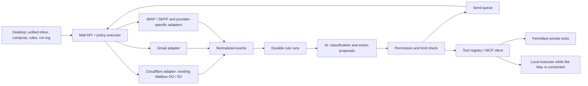

# Architecture — a proposal, not as-built

Depends on: [brief](brief.md), [measured baseline](evidence.md). Cloud mode and macOS were confirmed by the user on 2026-09-26. New infrastructure and real connections are not configured yet.

## Current implementation and deviations

As-built source: [implementation](implementation.md), [setup](setup.md). The desktop app is a separate sandboxed remote host (`desktop/main.cjs`), not the bundled offline renderer of the original proposal. The Gmail runtime and the rules run in Durable Objects; there is no local device executor and no IMAP adapter. Gmail and Cloudflare each have their own persisted send coordinator with shared accepted/unknown semantics, but not yet one common MailProvider interface. The UI and the inbound MCP share the Cloudflare outbox, which does not mean a completed per-agent policy for all entry points. The rest of this document keeps the target design; it does not substitute it for the current code.

## Layers

In cloud mode, runs and the credentials of server-side providers are stored on the server; the desktop app keeps a limited cache and a device credential in OS storage. In the local-only runtime, OAuth refresh tokens, IMAP sessions and tool execution live on the Mac. Cloudflare mail stays in the existing Worker in both variants. The decision to copy Gmail content to the cloud is not inferred from the presence of a Cloudflare deployment; it is recorded when the mode is chosen and the account is connected.

Reuse `app/components/` for the message, the editor and the split view; `workers/lib/tools.ts` as material for domain operations, not as an immutable API. The existing SSR entry cannot simply be loaded as a local static renderer: a separate desktop entry with the same components and an explicit transport is required.

Electron is the proposed path, with Node-side IMAP/SMTP connectors; Tauri is the alternative choice. Renderer from packaged resources; `nodeIntegration: false`, `contextIsolation: true`, sandbox; narrow typed IPC with origin/sender/schema checks. A message gets no access to IPC. External links and mailto are validated; remote image loading is controlled separately. These measures follow the [Electron security guide](https://www.electronjs.org/docs/latest/tutorial/security); neither a native smoke test nor a memory comparison has been performed yet.

## Shared contracts (design)

- `Account`: opaque `accountId`, provider kind, display address, sender identities, capabilities, sync status, runtime location. The email address is not the only global ID.
- `MessageRef`: `accountId + providerMessageId`; the local internal ID is separate. Gmail message/thread IDs are not equal to the RFC Message-ID. The IMAP key includes folder + UIDVALIDITY + UID; a UIDVALIDITY change invalidates the cursor.
- `MailProvider`: `list/get/thread/search`, `sync(cursor)`, `draft`, `send`, `reply`, `forward`, `setRead`, `archive`, `getAttachment`, `capabilities`. An operation returns a typed failure, not an empty successful list. An unsupported operation is explicitly unavailable.
- `SyncCursor`: provider-specific opaque state + account + generation. The batch is written durably first, then the cursor advances. The initial import does not start automatic external actions on historical messages without a separate choice.
- `MailEvent`: source account, stable event key, received/source timestamp, change kind, message reference. Uniqueness is enforced in storage; a repeated event does not run the same rule again.
- `Rule`: id, version, enabled, accounts, predicates, permitted actions, destinations, tools, approval mode, per-run/day limits. A change of permissions creates a new version. Enabling and stopping are recorded by the user.
- `Run`: event + rule/version, status, steps, provenance, model/config, cost, attempts, results. State machine: pending → running → waiting_approval/waiting_device/succeeded/failed/unknown/cancelled.
- `ActionProposal`: typed arguments + schema version + source references; the model proposes, the executor verifies independently. A tool result and an email body are data, not new rules.
- `ActionGrant`: account, operation, recipient/tool allowlist, bounded arguments, expiry/limit, issuedBy. A one-time confirmation is bound to the digest of the exact arguments and to the rule version; changing the recipient or an attachment invalidates it.
- `OutboxItem`: action ID/idempotency key, intent, provider receipt, pending/sending/accepted/failed/unknown. `accepted` means the transport accepted it, not that it was delivered to the recipient. Do not promise exactly-once SMTP: a crash after send and before the receipt is written gives unknown, then reconcile or a manual decision, with no blind retry.

A shared executor serves the UI, the AI chat, the rules and the inbound MCP. Otherwise the old MCP send becomes a bypass of the new rules. The prompt and the AI injection classifier are additional signals; permissions are enforced by code and by the server-side grant.

## Connections

**Cloudflare.** Keep the existing mail storage and receiving, add a normalized event and a real queue. Account for the SMTP envelope recipient, not only the MIME To, for alias/BCC/forward. Design the delivery key for the case where the RFC Message-ID is missing or repeated. Verify migrations and replay on local fixtures, without changes to production R2/DO.

**Gmail.** OAuth through the system browser, state/PKCE where applicable, refresh/revoke and limited scopes. Full sync + history cursor; on expired history, a resync without repeated automation side effects. Cloud mode: Pub/Sub watch with subscription renewal; push is only a sync trigger. Device-only: incremental poll, explicit offline. [Gmail sync](https://developers.google.com/workspace/gmail/api/guides/sync), [Gmail push](https://developers.google.com/workspace/gmail/api/guides/push).

**Others.** An IMAP/SMTP adapter in the Node runtime is the proposed portable option; start with one real provider of the operator's. For always-on operation the mode requires a persistent connector service or a verified compatible runtime, chosen separately. This is not a claim that Workers do not support TCP at all: [Workers sockets](https://developers.cloudflare.com/workers/runtime-apis/tcp-sockets/) support outbound sockets with limitations; the compatibility of the chosen IMAP library and of long sessions has not been checked yet. Microsoft Graph and Proton Bridge are separate provider-specific decisions based on the actual list of accounts.

**Tools.** `ToolRegistry` stores descriptions, JSON schemas, read/write kind, scopes, execution location, auth reference, timeout. The outbound MCP client is a new module; the inbound `/mcp` is reused through the executor. A local MCP gateway must not be exposed externally for the sake of cloud rules. The device bridge pulls permitted jobs itself; a disconnected Mac means waiting_device, not success.

## AI acceptance

Synthetic set: an ordinary message, an invoice, a newsletter, an ambiguous recipient, instruction injection in body/subject/attachment/tool output, a repeated event, a revoked token, a provider timeout after send, a forwarding loop, an unavailable local tool, budget exhaustion. For each, the expected classification/action/deny/approval is set in advance. Measure extraction quality separately from enforcement: the model may be wrong, and the denial must not depend on its verdict.

Limits: a finite number of tool steps, an overall retry limit, timeouts, a per-rule message/day cap and a budget. Pause blocks new actions; a send already confirmed by the provider is not shown as cancelled. The journal keeps enough for recovery, but without OAuth tokens and without the full message body in ordinary logs.
