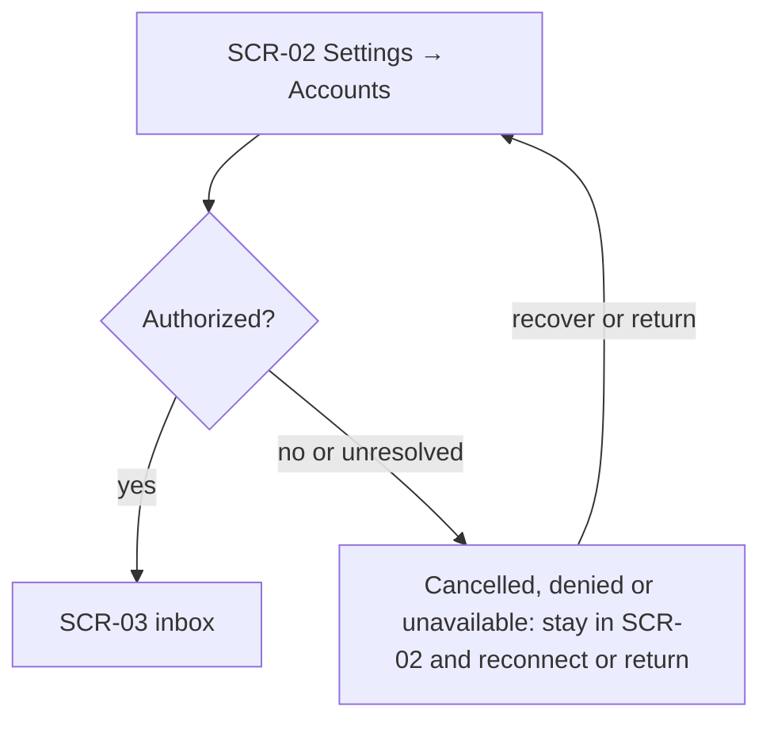
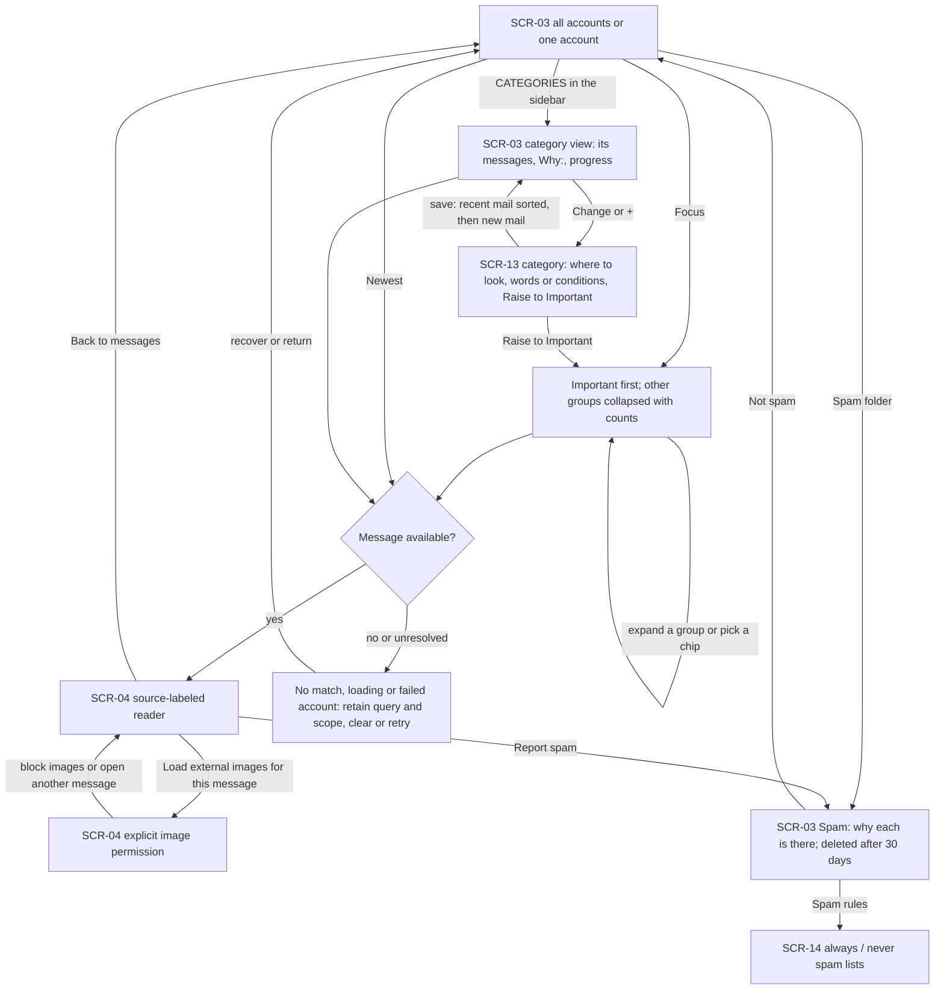
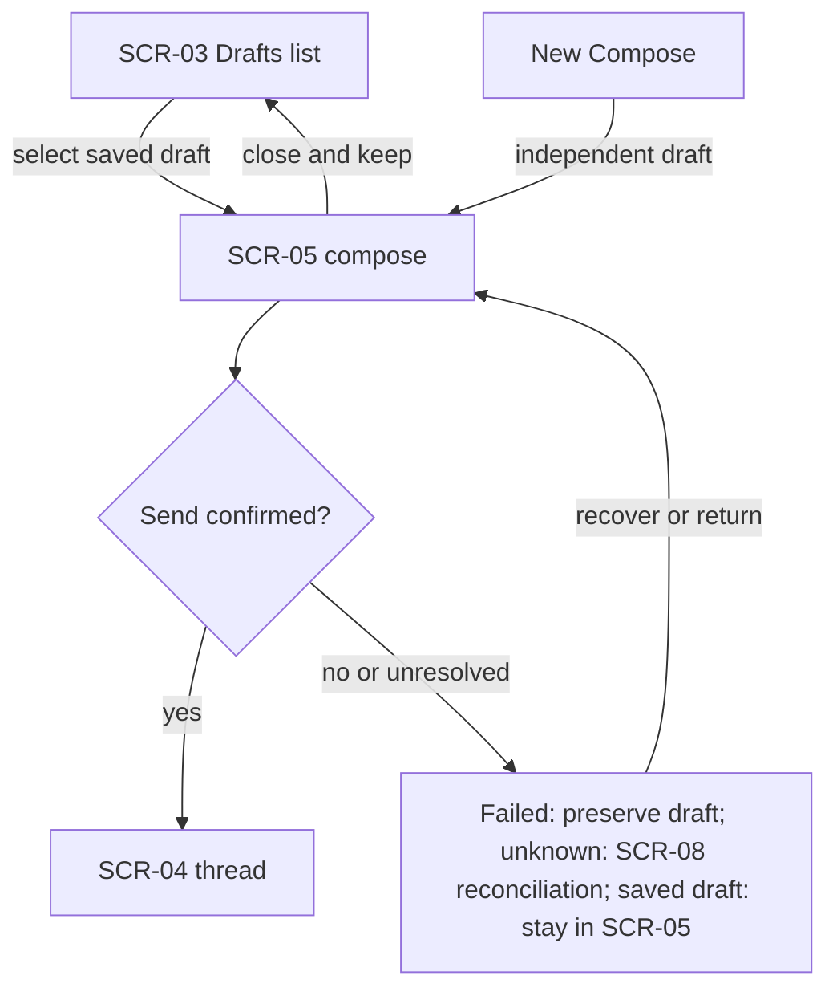
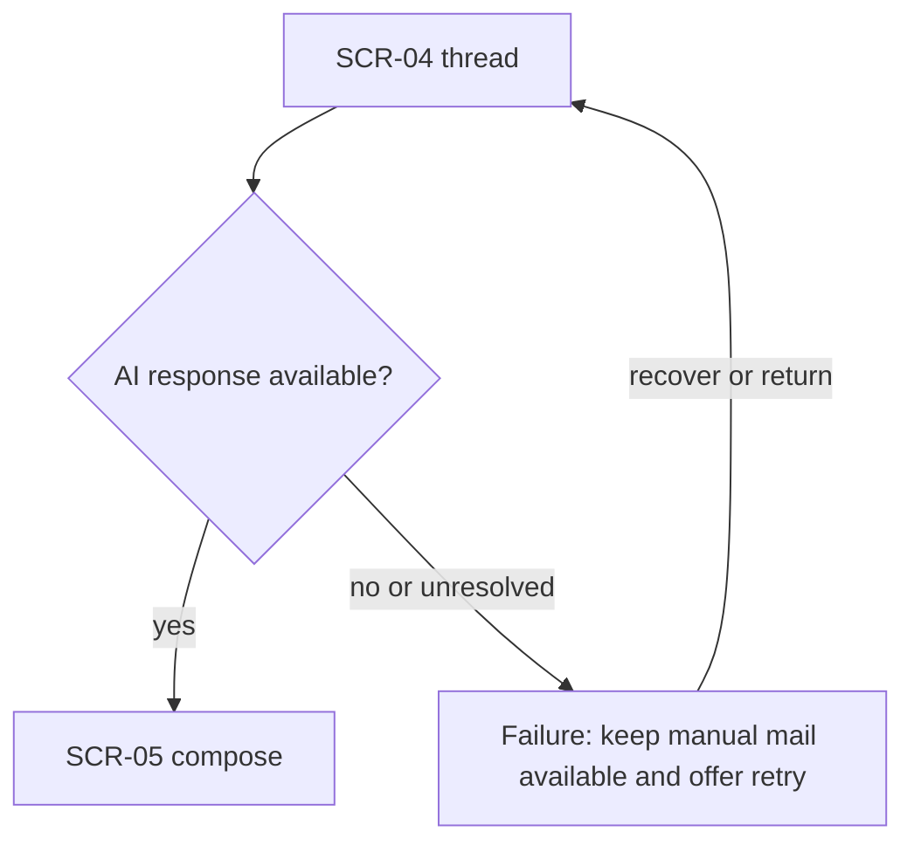
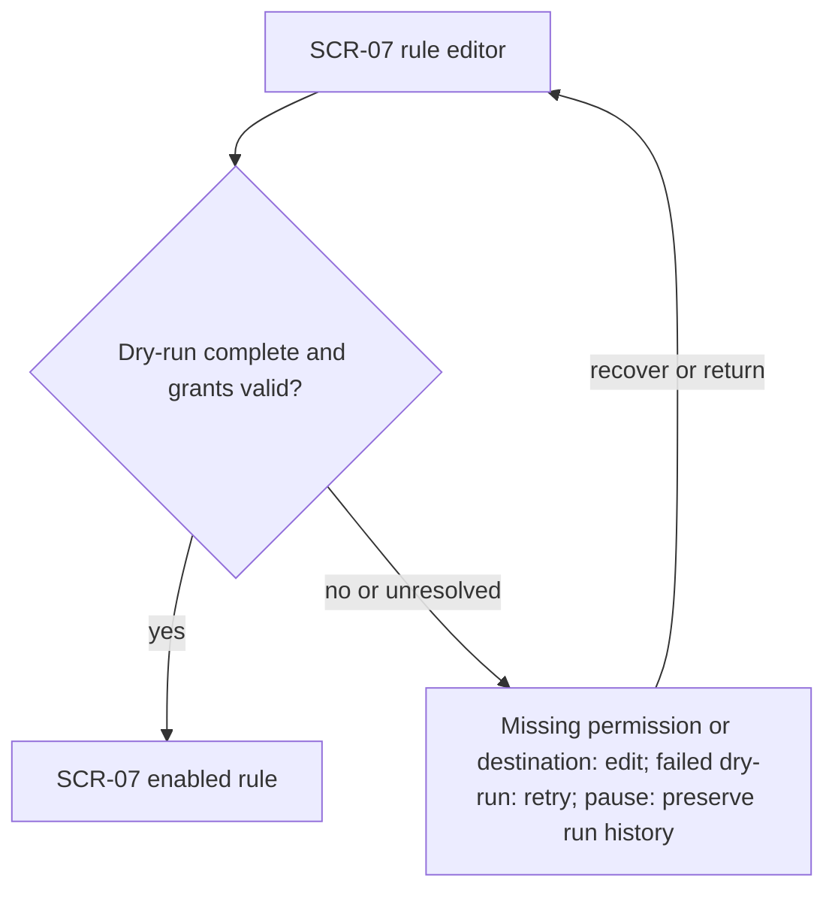
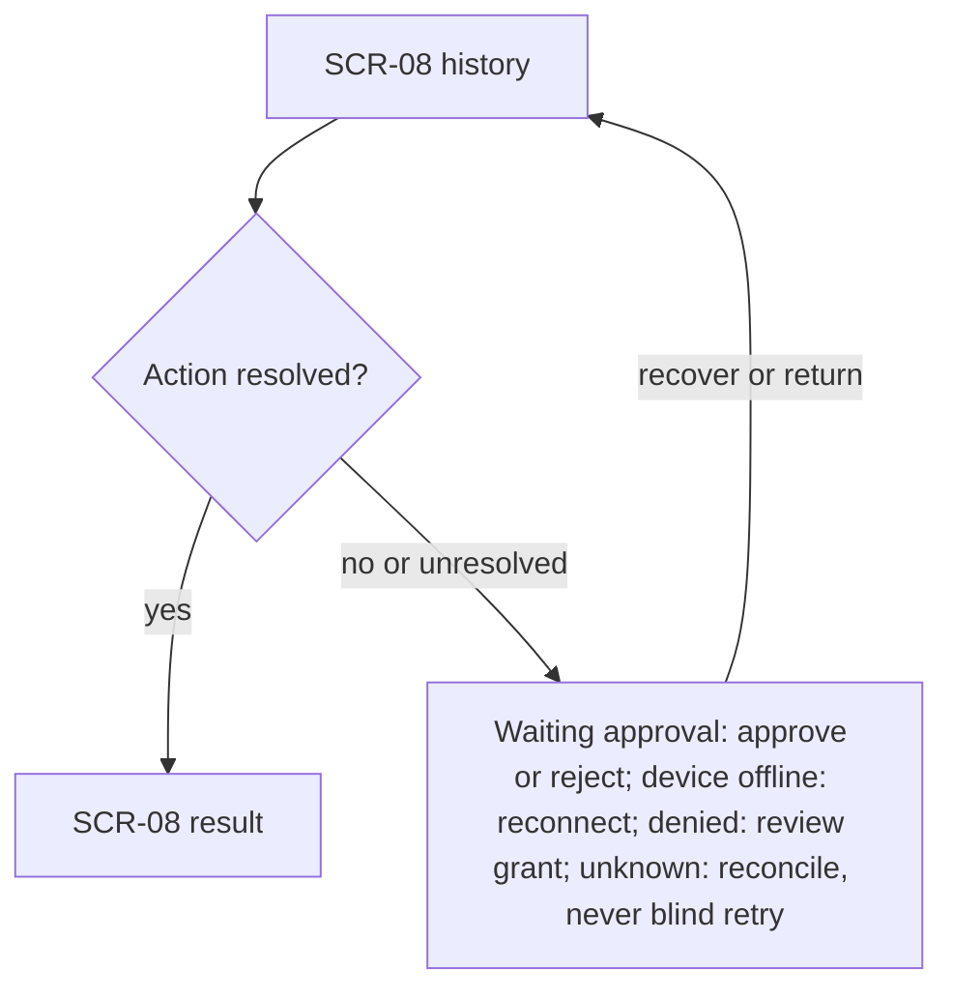
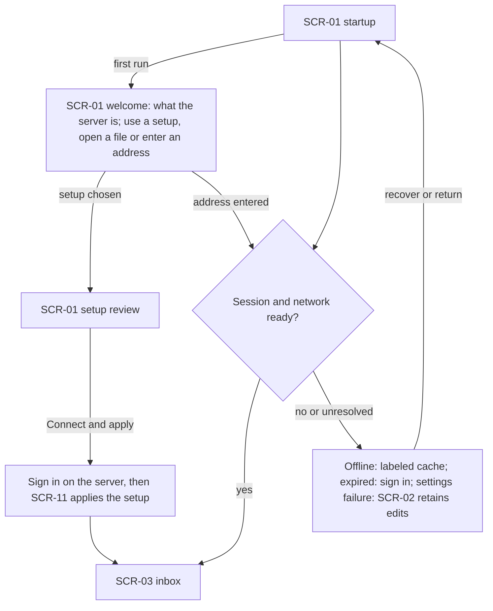
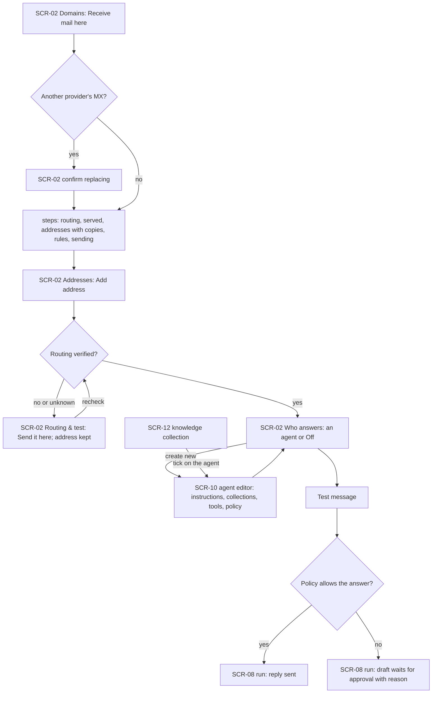

# User Flows

<!-- Managed with super-ux (ux-contract v4). Update affected layers in the same change as behavior. -->

## Design decisions
Criteria recorded before comparison: preserve source identity, keep mail usable when automation fails, reach an existing inbox quickly, and expose recovery without granting extra permissions. Selected: inbox with account scope and dedicated Rules/History areas. Alternative: chat-first navigation with all mail and automation commands inside one conversation. It loses because source identity and pending-action review require repeated reconstruction. Alternative locator: this paragraph. Reopen only if observed user tests show the dedicated areas prevent completion. The owner-requested workbench now uses Fabric website tokens for white/light and dark surfaces (RE-008, RE-010). Legacy account-specific routes remain available.

First value is opening a source-labeled thread. Rule setup is optional and does not delay mail access. Cloud execution while Mac is off is an approved constraint, not a design alternative. Figma is deferred and no external reference sweep is claimed.

## Current delivery boundary
The diagrams below remain target flows. `app/routes/unified-inbox.tsx` (`UnifiedInbox`, `scope`) supplies All inboxes, account/folder/query URL scope, source-labeled rows and the reader in one workbench. `Composer` in `app/components/inbox/Composer.tsx` supplies sender selection, account-fixed replies and recovery of the same locked send attempt. A new or reply action resumes an existing draft rather than silently replacing it. `Rules & history` asks which account to use before opening its existing automation route; the reader also links directly to its own account's rules.

Forwarding remains text-only, search covers cached data, and the reader displays individual messages rather than full threads. Rules/approval/history exist (`app/routes/automation.tsx`), but dry-run is not a prerequisite to enabling. Desktop recovery offers retry/configure, not cached mail (`desktop/main.cjs`). Theme changes use the workbench switch; settings for existing mailboxes and the native server stay separate. These gaps do not rewrite the approved target to match current code. Scoped browser observations live in [workbench verification](../desktop-mail/workbench-verification.md).

## Index
| ID | Goal | Stories |
|---|---|---|
| FLW-01 | Connect an account | ST-001 |
| FLW-02 | Find and handle a conversation | ST-002 |
| FLW-03 | Write and send mail | ST-003 |
| FLW-04 | Review AI help | ST-004 |
| FLW-05 | Set up a rule | ST-005 |
| FLW-06 | Inspect and control a run | ST-006 |
| FLW-07 | Resume and manage preferences | ST-007 |
| FLW-08 | Put an agent on a project address | ST-008 |

### FLW-01: Connect an account
- **Traces:** ST-001; RE-001, RE-003
- **Goal:** Connected account visible in inbox.
- **Entry points:** Settings or first-run connect action.
- **Success exit:** Connected account visible in inbox.
- **Task analysis:** Choose provider; review capabilities; authorize; inspect sync status.
- **Flow:**

- **Screens traversed:**

| Screen | States used here |
|---|---|
| SCR-02 | loading, empty, error, success |
| SCR-03 | loading, empty, error, success |

- **Scenario coverage:** SCN-002, SCN-003, SCN-051, SCN-052.

### FLW-02: Find and handle a conversation
- **Traces:** ST-002; RE-001, RE-003
- **Goal:** Correct account thread and action result visible.
- **Entry points:** Inbox, account selector or search.
- **Success exit:** Correct account thread and action result visible.
- **Task analysis:** Keep all accounts visible; choose All inboxes or one account; read Important first, open a group or filter unread; search or select a source-labeled message; read; act; return to the list on a narrow window.
- **Flow:**

- **Screens traversed:**

| Screen | States used here |
|---|---|
| SCR-03 | loading, empty, error, success |
| SCR-04 | loading, empty, error, success |
| SCR-13 | loading, empty, error, success |
| SCR-14 | loading, empty, error, success |

- **Scenario coverage:** SCN-004, SCN-005, SCN-010, SCN-011, SCN-026, SCN-027, SCN-036, SCN-037, SCN-038, SCN-039, SCN-040, SCN-041, SCN-042.

### FLW-03: Write and send mail
- **Traces:** ST-003; RE-001, RE-003
- **Goal:** Draft retained or transport outcome visible.
- **Entry points:** Compose, draft, reply, reply all, forward or mailto.
- **Success exit:** Draft retained or transport outcome visible.
- **Task analysis:** Review sender; edit recipients and content; attach; save or send.
- **Flow:**

- **Screens traversed:**

| Screen | States used here |
|---|---|
| SCR-04 | loading, empty, error, success |
| SCR-05 | loading, empty, error, success |
| SCR-08 | loading, empty, error, success |

- **Scenario coverage:** SCN-006, SCN-007, SCN-008, SCN-009.

### FLW-04: Review AI help
- **Traces:** ST-004; RE-001, RE-003
- **Goal:** Sourced answer or editable draft.
- **Entry points:** AI action on a selected thread.
- **Success exit:** Sourced answer or editable draft.
- **Task analysis:** Select source; ask; review; use draft if wanted.
- **Flow:**

- **Screens traversed:**

| Screen | States used here |
|---|---|
| SCR-04 | loading, empty, error, success |
| SCR-05 | loading, empty, error, success |

- **Scenario coverage:** SCN-013.

### FLW-05: Set up a rule
- **Traces:** ST-005; RE-001, RE-003
- **Goal:** Explicit enabled or paused rule with version visible.
- **Entry points:** Rules navigation or create action.
- **Success exit:** Explicit enabled or paused rule with version visible.
- **Task analysis:** Define scope; dry-run; review proposed effects; enable; pause when needed.
- **Flow:**

- **Screens traversed:**

| Screen | States used here |
|---|---|
| SCR-07 | loading, empty, error, success |

- **Scenario coverage:** SCN-014, SCN-015.

### FLW-06: Inspect and control a run
- **Traces:** ST-006; RE-001, RE-003
- **Goal:** Result or actionable waiting state understood.
- **Entry points:** History, waiting badge or rule detail.
- **Success exit:** Result or actionable waiting state understood.
- **Task analysis:** Choose run; read source and action; resolve approval or blocker; inspect outcome.
- **Flow:**

- **Screens traversed:**

| Screen | States used here |
|---|---|
| SCR-08 | loading, empty, error, success |

- **Scenario coverage:** SCN-016, SCN-017, SCN-018, SCN-020.

### FLW-07: Resume and manage preferences
- **Traces:** ST-007; RE-001, RE-003
- **Goal:** Session restored and saved work available with honest freshness.
- **Entry points:** App launch, mailto, Settings.
- **Success exit:** Session restored and saved work available with honest freshness.
- **Task analysis:** Open app; on first run choose a setup or a server; sign in if needed; inspect freshness; restore draft or settings.
- **Flow:**

- **Screens traversed:**

| Screen | States used here |
|---|---|
| SCR-01 | loading, empty, error, success |
| SCR-02 | loading, empty, error, success |
| SCR-03 | loading, empty, error, success |
| SCR-05 | loading, empty, error, success |
| SCR-11 | loading, empty, error, success |
| SCR-15 | loading, empty, error, success |

- **Scenario coverage:** SCN-001, SCN-012, SCN-019, SCN-028, SCN-030, SCN-043, SCN-044, SCN-047, SCN-048, SCN-049, SCN-050.

### FLW-08: Put an agent on a project address
- **Traces:** ST-008; RE-001
- **Goal:** A project address receives mail and its agent answers within policy.
- **Entry points:** Settings → Addresses or Domains (the sidebar's Settings, + or Add address), or Add this address from recent mail to a missing address.
- **Success exit:** Address verified, agent assigned, first message handled and visible in history.
- **Task analysis:** Choose domain and address; verify routing; choose or create an agent; set its policy and tools; send a test message; watch the first run.
- **Flow:**

- **Screens traversed:**

| Screen | States used here |
|---|---|
| SCR-02 | loading, empty, error, success |
| SCR-10 | loading, empty, error, success |
| SCR-08 | loading, empty, error, success |
| SCR-11 | loading, empty, error, success |
| SCR-12 | loading, empty, error, success |

- **Scenario coverage:** SCN-021, SCN-022, SCN-023, SCN-024, SCN-025, SCN-029, SCN-031, SCN-032, SCN-033, SCN-034, SCN-035, SCN-045, SCN-046.
